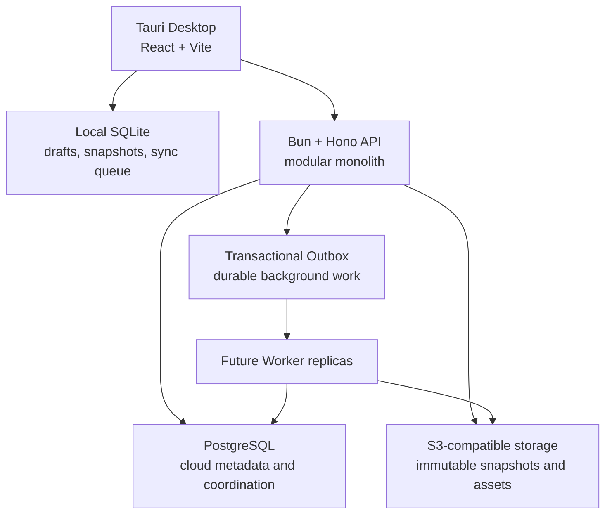

# KOMYAKU / 稿脈


KOMYAKU is a multilingual, local-first document evolution platform. It is designed to preserve not only the latest text, but also the complete lineage of drafts, named versions, branches, restorations, reviews, and AI-assisted continuations.

The name 稿脈 can be read as the “lineage of drafts”: the path through which a piece of writing changes over time.

KOMYAKU is intended for long-lived work such as novels, research notes, technical specifications, editorial projects, translations, and institutional records. Its central promise is simple:

> Writing and preserving history should remain accessible. Cloud storage, collaboration, managed computation, and advanced analysis may be paid services, but a user's writing must never be held hostage.

## Project status

KOMYAKU is currently a foundation-stage project, not a production-ready end-user application.

The repository already contains working infrastructure, schemas, security boundaries, persistence adapters, and tests. The full editor, Version Graph UI, sharing interface, cloud synchronization flow, and provider-specific AI integrations are still under development.

| Area | Status | Current state |
|---|---|---|
| React + Tauri desktop shell | Implemented foundation | Builds and runs with a local SQLite database |
| Japanese, English, Simplified Chinese UI | Implemented foundation | Initial i18n resources and locale switching |
| Structured document model | Implemented foundation | Versioned Canonical Schema, stable Node IDs, first-class content nodes, migrations, and ProseMirror adapters |
| PostgreSQL cloud schema | Implemented foundation | Identity, workspace, conversation, job, and outbox tables |
| Durable outbox dispatch | Implemented foundation | PostgreSQL leases and atomic, idempotent Outbox-to-Job publication |
| Durable job execution | Implemented foundation | Registered handlers, attempt history, retries, dead letters, and raw archive verification |
| Mutation idempotency | Implemented foundation | HMAC-protected keys, exact request fingerprints, and reference-only replay |
| Dead-letter operations | Implemented internal boundary | Exact-job retry with preserved history and atomic operator audit; no public endpoint |
| Plan catalog and entitlements | Implemented foundation | Provider-independent stable keys, typed limits, local core, and layered overrides |
| Production configuration and logging | Implemented foundation | Fail-fast environment validation and redacted JSON Lines |
| S3-compatible storage | Implemented foundation | Immutable writes, Workspace-scoped content addressing, verified deduplication, reference accounting, and MinIO development setup |
| Identity and sessions | Implemented domain layer | Argon2id passwords, hashed sessions, revocation, verification/reset tokens |
| Distributed authentication rate limits | Implemented domain layer | PostgreSQL-shared counters with HMAC-protected identifiers |
| Conversation archive | Implemented foundation | Canonical DAG, generic JSON importer, immutable raw archive service |
| Authenticated conversation import API | Implemented, gated | Idempotent raw JSON POST and membership-checked status GET |
| AI handoff | Implemented review boundary | Context-bound preview and explicit confirmation; provider sending is not enabled |
| Public authentication endpoints | Implemented, disabled by default | SMTP delivery and rate-limited routes exist behind an explicit production feature gate |
| Document editing UI and Version Graph | Planned next stages | Domain and storage foundations exist; product workflow is not complete |
| Public/restricted/unlisted sharing | Designed | Database and policy model are planned; public APIs are not yet exposed |
| Billing | Architecture only | No payment provider is connected |

See [docs/ROADMAP.md](docs/ROADMAP.md) for the authoritative implementation status.

## Why KOMYAKU exists

Most editors treat history as a secondary recovery feature. KOMYAKU treats history as first-class product data.

A document is not only a mutable file. It is a graph of decisions:

```text
Draft 1
  ↓
Draft 2
  ├── Editorial branch
  ├── Translation branch
  └── Alternative ending
          ↓
       Restored and revised version
```

This model supports several important behaviors:

- A previous version is never silently rewritten.
- Restoring an old version creates a new descendant instead of erasing later history.
- Branches are explicit and can coexist.
- Merge versions may have more than one parent.
- The graph remains useful even when the user never learns Git terminology.
- Export and local storage remain available independently of cloud billing.

KOMYAKU may interoperate with Git in advanced workflows, but Git is not the user-facing mental model.

## Core product principles

### Preserve authored content

KOMYAKU must not silently lose, rewrite, or normalize authored text. This includes combining characters, emoji sequences, bidirectional text, variation selectors, uncommon scripts, and mixed-language content.

Unicode normalization may be used for derived search keys when explicitly documented. It must not replace the canonical authored source.

### Preserve history

Versions form an immutable directed acyclic graph. History is not a list of disposable backups. Branches, restores, merges, labels, authorship, and timestamps remain independently inspectable.

### Remain local-first

The desktop application must remain useful without an account or network connection. Local drafts, snapshots, history, graph operations, diff, and export are intended to work from device storage.

Cloud services add synchronization, remote backup, web access, team collaboration, and managed processing. They do not become a prerequisite for opening or exporting local work.

### Support international writing from the data model upward

Internationalization is not limited to translated buttons. KOMYAKU separates:

- interface locale;
- document language metadata;
- per-range language and direction;
- authored Unicode content;
- locale-aware presentation of dates and numbers.

The initial interface locales are:

- English (`en`)
- Japanese (`ja`)
- Simplified Chinese (`zh-Hans`)

The document model is not limited to those languages.

### Make privacy the default

Documents, imported conversations, drafts, recovery snapshots, share tokens, credentials, and AI handoff context are sensitive data.

The default AI training policy is `deny`. Application logs must not contain document bodies, passwords, raw session tokens, unlisted share tokens, or raw AI handoff payloads.

### Scale by preserving boundaries

The initial deployment is a single Bun server. The code avoids correctness that depends on one process, sticky sessions, or local server files, allowing API and Worker replicas to be separated later.

KOMYAKU starts as a modular monolith. It does not begin as a collection of premature microservices.

## Intended document capabilities

The canonical editor model is designed for more than plain Markdown.

Supported or planned content includes:

- paragraphs, headings, lists, quotations, links, tables, and code blocks;
- authored LaTeX source for mathematical content;
- Mermaid source for diagrams;
- images, audio, PDF files, and other attachments;
- ruby annotations and language/direction metadata;
- provider-independent embedded content with explicit schema versions;
- export to basic text formats, with advanced PDF, DOCX, EPUB, and archive exports planned.

LaTeX and Mermaid source are preserved as authored source rather than being replaced by a rendered image. PDF documents are treated as assets with immutable storage and metadata; richer PDF inspection and export workflows are later-stage features.

## Visibility and sharing model

The design distinguishes four visibility modes:

| Mode | Who can read it |
|---|---|
| `private` | Only authorized workspace members |
| `restricted` | Explicitly authorized users or groups |
| `unlisted` | Anyone possessing a valid secret URL token |
| `public` | Anyone, but only through an explicitly published version |

Important invariants include:

- A public document does not make drafts or recovery snapshots public.
- An unlisted token is a secret credential and is stored as a hash.
- Restricted access requires authenticated permission checks.
- Authorization failures must not reveal whether a private resource exists.
- Object storage paths use IDs, never document titles.
- Download access is mediated by an authenticated API or short-lived signed URL.

These policies are designed but the complete sharing API and UI are not yet implemented.

## Conversation archive and AI handoff

KOMYAKU also applies its history model to AI conversations.

The intended workflow is:

```text
ChatGPT / Claude / Gemini / generic JSON export
                    ↓
         Immutable raw source archive
                    ↓
      Provider-independent conversation DAG
                    ↓
          User selects an exact branch
                    ↓
       Explicit provider/model/context review
                    ↓
          Response saved as a new branch
```

The current generic JSON importer supports:

- linear conversations;
- explicit `parentId` branches;
- unknown roles and provider-specific content parts;
- exact UTF-8 source preservation;
- duplicate source ID warnings;
- missing-parent warnings;
- cycle rejection;
- parser version and SHA-256 provenance;
- a default limit of 10 MiB and 10,000 messages.

Imported content is untrusted data. Text inside an imported conversation cannot expand the selected context, access credentials, change KOMYAKU policy, or authorize transmission to another provider.

AI handoff is designed only for official APIs, user-configured compatible endpoints, approved connectors, and local models. KOMYAKU does not reuse consumer web session cookies or automate login to a provider's consumer website.

Sending context to an AI provider and allowing data to be used for model training are separate permissions.

See [docs/guides/conversation-json-import.md](docs/guides/conversation-json-import.md) and [docs/architecture/conversation-archive-and-ai-handoff.md](docs/architecture/conversation-archive-and-ai-handoff.md).

## Local and cloud product model

KOMYAKU follows a local-first Freemium model without advertising.

### KOMYAKU Local

The intended local core is free and limited primarily by the user's device storage:

- local documents;
- local SQLite persistence;
- local version history;
- Version Graph and diff;
- branches and restore operations;
- local conversation import;
- export.

### KOMYAKU Cloud

Cloud plans may provide:

- multi-device synchronization;
- remote backup;
- web access;
- larger object storage quotas;
- collaboration and review;
- workspace permissions and audit logs;
- advanced history search and semantic analysis;
- managed AI usage;
- long-term and immutable archive options.

The pricing principle is:

> Writing and recording history are free. Cloud storage, collaboration, managed AI, and advanced analysis are paid capabilities.

Version count should not be the main billing restriction because preserving versions is the core product value. Cloud storage consumption, especially images, PDFs, attachments, exports, and backup retention, is a more appropriate quota.

Plan names and prices in the documentation are hypotheses, not current commercial offers. See [docs/product/pricing-and-plans.md](docs/product/pricing-and-plans.md).

## Architecture



### Desktop

`apps/desktop` is a React 19, Vite, and Tauri 2 application. Tauri conceptually serves a static SPA, while the official SQL plugin provides local SQLite access.

TanStack Start is intentionally not installed in the current desktop application. Tauri remains a Vite SPA and Hono remains the cloud API boundary. See [ADR-017](docs/adr/ADR-017-defer-tanstack-start-adoption.md).

### Server

`apps/server` is a Bun and Hono modular monolith. Route handlers must not own document graph rules or storage behavior. Domain behavior belongs in packages and application services; PostgreSQL and object storage access belong in repositories.

The server already exposes:

- `GET /api/v1/health`
- `GET /health/live`
- `GET /health/ready`
- `GET /api/v1/privacy/ai-training-policy`

Authentication and import domain services exist, but their public HTTP routes remain disabled until the required production boundaries are complete.

### PostgreSQL

PostgreSQL is the authority for cloud metadata, identities, workspace permissions, session revocation, distributed rate limits, outbox events, and future usage ledgers.

Migrations are immutable ordered SQL files. The migration runner uses a dedicated connection and PostgreSQL advisory lock so multiple application instances cannot apply the same migration concurrently.

### Object storage

Version snapshots, imported raw conversations, and attachments use S3-compatible object storage. Writes are immutable and checksummed. Local development uses MinIO.

Database transactions and object storage writes cannot form one atomic transaction. The design therefore uses pending states, immutable hashes, outbox events, and reconciliation jobs instead of pretending cross-system atomicity exists.

### Distributed evolution

The initial runtime is one server, but shared state is not kept only in process memory.

```text
Phase A: API + Outbox Poller + Worker in one Bun server
Phase B: separate API, Worker, and Scheduler processes
Phase C: horizontal API and Worker replicas
Phase D: multi-region only after consistency and residency review
```

Sessions and authentication rate limits already use PostgreSQL, so they remain consistent across future replicas. Durable work uses a transactional outbox and is designed for at-least-once delivery with idempotent handlers.

See [docs/architecture/distributed-runtime.md](docs/architecture/distributed-runtime.md).

## Repository layout

```text
apps/
├── desktop/                  React + Vite + Tauri desktop shell
└── server/                   Bun + Hono API and application services

packages/
├── ai-gateway/               Provider-independent AI handoff review
├── api-client/               Client/API boundary
├── conversation-importer/    Generic JSON conversation importer
├── conversation-schema/      Canonical conversation DAG
├── diff-engine/              Future multilingual diff boundary
├── document-schema/          Canonical document boundary
├── editor-core/              ProseMirror schema foundation
├── i18n/                     en, ja, and zh-Hans resources
├── shared/                   Cross-runtime policies and constants
├── storage-core/             S3-compatible immutable storage
├── sync-core/                Offline/cloud synchronization boundary
└── version-engine/           Immutable Version DAG boundary

database/
└── migrations/               Ordered PostgreSQL migrations

docs/
├── adr/                      Accepted architecture decisions
├── architecture/             System architecture
├── formats/                  Versioned data-format specifications
├── guides/                   Development and feature manuals
├── product/                  Pricing and product hypotheses
├── KOMYAKU設計仕様書.md       Primary detailed design specification
└── ROADMAP.md                Implementation status
```

The implemented Canonical Document JSON contract is specified in [docs/formats/canonical-document-v1.md](docs/formats/canonical-document-v1.md). It is intentionally separate from both ProseMirror JSON and the future open `.komyaku` archive container.

## Requirements

- Bun 1.3 or later
- Rust 1.93 or later
- Docker Desktop or Docker Engine with Compose
- Platform prerequisites required by Tauri 2

The repository currently pins the workspace package manager as Bun 1.3.11.

## Quick start

### 1. Create the local environment file

```sh
cp .env.example .env
```

The checked-in values are development examples only. Do not use them in production.

### 2. Install JavaScript dependencies

```sh
bun install
```

### 3. Start PostgreSQL and MinIO

```sh
docker compose up -d
docker compose ps
```

Local services use these default addresses:

| Service | Address |
|---|---|
| PostgreSQL | `127.0.0.1:5432` |
| MinIO S3 API | `http://127.0.0.1:9000` |
| MinIO console | `http://127.0.0.1:9001` |

### 4. Apply database migrations

```sh
bun run db:migrate
```

The command is safe to rerun. It executes only unapplied migrations while holding the migration lock.

### 5. Initialize object storage

```sh
bun run storage:init
```

The command creates the configured S3-compatible bucket if it does not already exist.

### 6. Start the API server

Run this in one terminal:

```sh
bun run dev:server
```

The default API address is `http://127.0.0.1:3000`.

Check readiness with:

```sh
curl -i http://127.0.0.1:3000/health/ready
```

### 7. Start the frontend

For browser-based Vite development, run in another terminal:

```sh
bun run dev
```

Open `http://localhost:1420`.

For the native Tauri development window, use:

```sh
bun run tauri dev
```

The current UI is a foundation shell, not the completed editor.

## Environment variables

The complete development example is in [.env.example](.env.example).

| Variable | Purpose | Development default |
|---|---|---|
| `SERVER_HOST` | API bind address | `127.0.0.1` |
| `SERVER_PORT` | API port | `3000` |
| `NODE_ENV` | Runtime safety profile | `development` |
| `LOG_LEVEL` | Structured log threshold | `debug` |
| `SERVICE_NAME` | Structured log service identity | `komyaku-server` |
| `CORS_ORIGINS` | Explicit comma-separated browser origins | Local Vite origins |
| `DEPLOYMENT_MODE` | `single`, `api`, or `worker` runtime role | `single` |
| `INSTANCE_ID` | Observable instance identity | Generated when empty |
| `SHUTDOWN_GRACE_MS` | Graceful shutdown deadline | `10000` |
| `DATABASE_POOL_MAX` | Maximum Bun SQL pool size | `10` |
| `JOB_BACKEND` | Durable work backend | `postgres-outbox` |
| `OUTBOX_BATCH_SIZE` | Events claimed in one dispatcher pass | `25` |
| `OUTBOX_LEASE_SECONDS` | Time before another worker may reclaim processing | `30` |
| `OUTBOX_POLL_INTERVAL_MS` | Idle polling interval | `1000` |
| `OUTBOX_MAX_ATTEMPTS` | Attempts before an event is marked failed | `10` |
| `JOB_BATCH_SIZE` | Jobs claimed per registered handler pass | `10` |
| `JOB_LEASE_SECONDS` | Worker lease before crash recovery | `60` |
| `JOB_POLL_INTERVAL_MS` | Idle Job Runner polling interval | `1000` |
| `DATABASE_URL` | PostgreSQL connection string | Local development database |
| `SESSION_TTL_SECONDS` | Lifetime of newly issued cloud sessions | `2592000` |
| `PASSWORD_RESET_MIN_RESPONSE_MS` | Minimum reset-request response time to reduce enumeration timing | `250` |
| `AUTH_RATE_LIMIT_SECRET` | HMAC key protecting stored rate-limit identifiers | Development-only example |
| `IDEMPOTENCY_SECRET` | HMAC key protecting stored mutation keys | Development-only example |
| `AUTH_ROUTES_ENABLED` | Mount public authentication routes | `false` |
| `NOTIFICATION_WORKER_ENABLED` | Deliver encrypted notification Jobs in this process | `false` |
| `NOTIFICATION_ENCRYPTION_KEY` | AES-256-GCM key encoded as 64 hexadecimal characters | Development-only example |
| `PUBLIC_APP_ORIGIN` | Origin used for verification and reset links | `http://localhost:1420` |
| `TRUSTED_PROXY_HOPS` | Controlled proxy hops trusted for client addresses | `0` |
| `SMTP_HOST`, `SMTP_PORT` | SMTP delivery endpoint | Empty host, port `587` |
| `SMTP_SECURE`, `SMTP_REQUIRE_TLS` | Implicit TLS or required STARTTLS policy | `false`, `true` |
| `SMTP_USER`, `SMTP_PASSWORD`, `SMTP_FROM` | SMTP credentials and sender | Empty |
| `OBJECT_STORAGE_ENDPOINT` | S3-compatible endpoint | `http://127.0.0.1:9000` |
| `OBJECT_STORAGE_REGION` | S3 region | `us-east-1` |
| `OBJECT_STORAGE_BUCKET` | Object bucket | `komyaku-local` |
| `AI_TRAINING_DEFAULT` | Default AI training policy | `deny` |
| `VITE_API_BASE_URL` | Frontend API base | `http://127.0.0.1:3000/api/v1` |

Production credentials must come from an appropriate secret manager. Never commit `.env`, object storage credentials, signing keys, provider API keys, raw session tokens, or notification tokens.

## Common commands

| Command | Purpose |
|---|---|
| `bun run dev` | Start the Vite frontend |
| `bun run dev:server` | Start the Hono API with file watching |
| `bun run tauri dev` | Start the native Tauri development application |
| `bun run db:migrate` | Apply pending PostgreSQL migrations |
| `bun run storage:init` | Create the configured object storage bucket |
| `bun run --filter @komyaku/server jobs:dead-letters list` | Inspect payload-free Dead Letter summaries |
| `bun run --filter @komyaku/server maintenance:retention` | Preview retention candidates without deletion |
| `bun run --filter @komyaku/server maintenance:assets --action reconcile --workspace UUID` | Reconcile one Workspace Asset prefix without deleting on discovery |
| `bun run --filter @komyaku/server maintenance:assets --action inspect` | Run one bounded baseline Asset inspection batch |
| `bun run --filter @komyaku/server test:auth-load` | Run the loopback authentication endpoint load regression |
| `bun run --filter @komyaku/server test:auth-production-load` | Run the explicitly enabled isolated PostgreSQL/SMTP Stage 2 harness |
| `bun test` | Run the default test suite |
| `bun run check` | Run checks in every workspace |
| `bun run build` | Build every workspace |
| `cargo check` | Check the Rust application from `apps/desktop/src-tauri` |

## Testing

Run the default suite:

```sh
bun test
```

Database integration tests are skipped by default. Start PostgreSQL, apply migrations, and run:

```sh
RUN_DB_INTEGRATION=1 bun test apps/server/test/integration
```

The integration suite creates records under unique test IDs and removes only those records after each test.

Useful full verification commands are:

```sh
bun test
bun run check
bun run build
cd apps/desktop/src-tauri
cargo check
```

The test strategy includes:

- migration ordering and idempotent replay;
- clean SQLite migration application;
- immutable S3 writes and checksums;
- conversation branches, dangling edges, and cycle rejection;
- Unicode preservation;
- Argon2id password hashing;
- 256-bit hashed session and one-time tokens;
- session revocation;
- concurrent distributed rate-limit attempts;
- concurrent Outbox leases and idempotent Job publication;
- Job attempt history, lease-expiry recovery, retry, and dead-letter transitions;
- concurrent mutation ownership and reference-only idempotent replay;
- atomic Dead Letter retry and operator audit records;
- conversation archive size and SHA-256 metadata verification;
- PostgreSQL transaction integration;
- AI handoff payload binding and explicit confirmation;
- encrypted transactional notification payloads and active-token delivery checks;
- authentication endpoint load percentile regression.

## Generic conversation JSON format

The generic importer accepts a top-level message array or an object with a `messages` array.

```json
{
  "title": "Research discussion",
  "defaultLanguage": "en",
  "schemaVersion": "1",
  "messages": [
    {
      "id": "m1",
      "parentId": null,
      "role": "user",
      "content": "What changed between these two drafts?"
    },
    {
      "id": "m2",
      "parentId": "m1",
      "role": "assistant",
      "content": "The second draft clarifies the conclusion."
    }
  ]
}
```

Omitting `parentId` creates an implicit link from the previous message. `parentId: null` creates a root. Multiple messages may point to the same parent to represent branches.

When authentication routes are explicitly enabled, verified workspace owners, admins, and editors can submit the exact source JSON to `POST /api/v1/workspaces/:workspaceId/conversation-imports`. The request requires a bearer session, JSON content type, and an idempotency key. Imports are private and deny AI training by default. Status is available from the corresponding workspace-scoped GET route. No unauthenticated upload endpoint is exposed.

## Authentication security

The implemented identity foundation uses:

- Bun Argon2id password hashing;
- a minimum of 15 and maximum of 1,024 Unicode code points;
- no arbitrary uppercase, number, or symbol composition rules;
- generic login failure errors and dummy password verification for unknown email addresses;
- a shared minimum response-time floor for known and unknown password-reset addresses;
- 256-bit random bearer session tokens;
- SHA-256 token hashes at rest;
- single-session and all-session revocation;
- single-use email verification and password reset tokens;
- full session revocation after password reset;
- PostgreSQL-shared rate limits for future horizontal API replicas;
- HMAC-SHA-256 identifiers so raw email and network values are not stored in the rate-limit table.

Public authentication routes and a provider-independent SMTP notification adapter are implemented. They are deliberately not mounted unless `AUTH_ROUTES_ENABLED=true`. One-time links are sealed with AES-256-GCM and committed to the Transactional Outbox beside their token hashes; a Durable Job confirms the token is still active before SMTP delivery. `NOTIFICATION_WORKER_ENABLED` allows delivery Workers to run independently from public API replicas.

The mounted surface covers registration, login, session inspection, single/all-session logout, email verification, and password reset under `/api/v1/auth`. Authentication responses are non-cacheable, JSON bodies are limited to 16 KiB, distributed limits run before expensive password work, and password-reset requests do not reveal account existence. Email templates support Japanese, English, and Simplified Chinese and contain only the required one-time action link, never document content.

Client network identity comes from the direct socket by default. `X-Forwarded-For` is ignored until an operator configures an exact positive `TRUSTED_PROXY_HOPS` value behind a controlled proxy that overwrites incoming forwarding headers. Encrypted delivery reconciliation and a reproducible local endpoint load harness are implemented. Representative PostgreSQL/SMTP/proxy load testing and an independent external security review remain required before production launch.

See [docs/guides/identity-and-sessions.md](docs/guides/identity-and-sessions.md).

Notification operation details are in [docs/guides/notification-delivery.md](docs/guides/notification-delivery.md).

## AI training refusal

KOMYAKU defaults to refusing use of user content for external AI training.

The current HTTP baseline can emit machine-readable refusal signals such as:

```text
X-Robots-Tag: noai, noimageai
TDM-Reservation: 1
```

These signals express the user's intent but cannot technically guarantee that every third party will comply. The stronger guarantee is architectural: KOMYAKU does not actively submit document content to training datasets, and AI handoff requires a separate explicit action.

See [docs/guides/ai-training-opt-out.md](docs/guides/ai-training-opt-out.md).

## Development rules and invariants

When extending KOMYAKU:

- Do not mutate an existing named version.
- Do not replace authored Unicode with normalized text.
- Do not store version history only as a single `parent_id` chain.
- Do not put document graph business rules in React components or HTTP route handlers.
- Do not use local server files as authoritative cloud storage.
- Do not put document bodies or secret tokens in ordinary logs, traces, job payloads, or billing records.
- Do not protect paid or private functionality only in the frontend.
- Do not make cloud availability or subscription status a prerequisite for local export.
- Do not silently discard unsupported imported conversation parts.
- Do not send AI context without an exact user-reviewed selection.
- Keep migrations ordered, immutable, and safe to replay.
- Keep all roadmap entries marked as `[Done]`, `[Next]`, or `[Later]`.
- Document important decisions, operational procedures, and technical boundaries under `docs/`.

## Documentation

Start with these documents:

- [Primary design specification](docs/KOMYAKU設計仕様書.md)
- [Roadmap](docs/ROADMAP.md)
- [Foundation architecture](docs/architecture/foundation.md)
- [Distributed runtime architecture](docs/architecture/distributed-runtime.md)
- [Conversation archive and AI handoff](docs/architecture/conversation-archive-and-ai-handoff.md)
- [Entitlements and billing](docs/architecture/entitlements-and-billing.md)
- [Production readiness](docs/guides/production-readiness.md)
- [Operator maintenance](docs/guides/operator-maintenance.md)
- [Pricing hypotheses](docs/product/pricing-and-plans.md)
- [Development setup](docs/guides/development-setup.md)
- [Identity and sessions](docs/guides/identity-and-sessions.md)
- [Dead-letter operations](docs/guides/dead-letter-operations.md)
- [Generic conversation import](docs/guides/conversation-json-import.md)
- [AI training opt-out](docs/guides/ai-training-opt-out.md)
- [Architecture Decision Records](docs/adr/)

The PDF copy of the primary specification is stored at `docs/KOMYAKU設計仕様書.pdf`. When the Markdown specification changes materially, the generated PDF should be refreshed and visually verified rather than assumed to be current.

## Contributing changes

Before implementing a feature:

1. Read the relevant design specification and ADRs.
2. Confirm whether the work is `[Next]` or `[Later]` in the roadmap.
3. Preserve local-first behavior and the privacy boundaries described above.
4. Put reusable domain behavior in a package or application service.
5. Keep infrastructure access behind repositories or adapters.
6. Add unit tests and, when storage behavior changes, a real PostgreSQL or object-storage integration test.
7. Update `docs/` when introducing a decision, configuration, workflow, or operator responsibility.
8. Run the full verification commands before handing off the change.

KOMYAKU is being built around a long time horizon. A feature is not complete merely because it works once; it must preserve user ownership, authored content, history, and recoverability as the system evolves.
