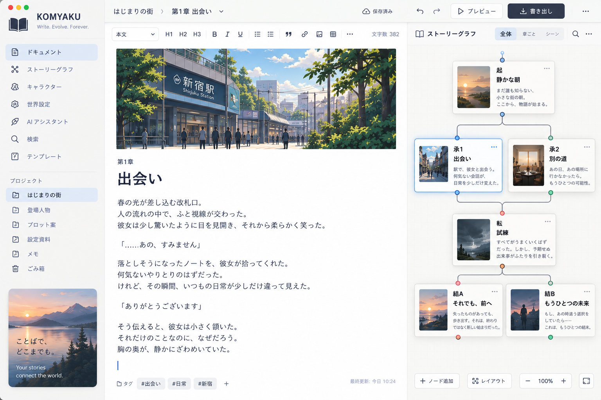

# KOMYAKU Story Graph

> 実施方針（2026-09-09）：本書は長期構想の原案として保持する。Story GraphはKOMYAKU本体完成後、独立したサンプルアプリとして `samples/story-graph/` で開発する。本体への組込みを前提とする以下の記述より、この実施順序と配置を優先する。[開発準備と境界](../samples/story-graph/README.md)・[サンプル用Roadmap](../samples/story-graph/ROADMAP.md)を参照。

## ノード型文章構築・物語設計システム 設計仕様書



### 0. 概要

KOMYAKUに、Blender / ComfyUIのNode Editorに近い操作感を持つ「Story Graph」を追加する。

従来の文章編集が、

「上から下へ文章を書く」

方式であるのに対し、Story Graphでは、

「文章を意味単位のノードとして配置し、その関係を接続して文章を構築する」

方式を採用する。

基本形は、

```text
[起] → [承] → [転] → [結]
```

とする。

ただし単純な線形構造に限定せず、

```text
              ┌→ [承1] ─┐
[起] ─────────┤          ├→ [転] → [結]
              └→ [承2] ─┘
```

のようなAlternative、

```text
[起] → [承] → [転]
                  ├→ [結末A]
                  ├→ [結末B]
                  └→ [結末C]
```

のような複数結末、

```text
[序章]
   ↓
[第一章]
   ↓
[第二章 Group]
   ├ [Scene 2-1]
   ├ [Scene 2-2]
   └ [Scene 2-3]
   ↓
[第三章]
```

のような階層構造を扱えるようにする。

Story Graphは小説だけではなく、

- 論文
- 脚本
- 記事
- 技術仕様書
- プレゼン原稿
- 教材
- 報告書
- 契約書
- ゲームシナリオ
- AIプロンプト設計

などにも利用可能な汎用「文章構造グラフ」とする。

# 1. KOMYAKU内部における位置付け

KOMYAKUには二種類のGraphを存在させる。

```text
KOMYAKU
│
├── Document Graph / Story Graph
│      「文章そのものの構造」
│
└── Version Graph
       「文章がどう変化したか」
```

Story Graph：

```text
[起] → [承] → [転] → [結]
```

Version Graph：

```text
V1 ─→ V2 ─→ V3
       │
       └→ V2-B ─→ V4
```

この二つを混同しない。

Story Graphのある状態全体をVersionとして保存する。

したがって、

```text
Story Graph at V1
       ↓ 編集
Story Graph at V2
       ↓ 分岐
Story Graph at V3A
Story Graph at V3B
```

という二重DAG構造になる。

これはKOMYAKUの非常に重要な特徴とする。

# 2. 基本思想

文章の最小単位を「ファイル」ではなく、

```text
意味を持ったBlock
```

として扱う。

例えば、

```text
[主人公が駅に到着する]
```

というノードは単なるテキストコンテナではない。

以下の情報を持つことができる。

```text
本文
役割
登場人物
場所
時刻
伏線
感情
目的
前提条件
結果
タグ
AI分析結果
```

つまりStory Nodeは、

「文章 + 意味メタデータ」

である。

# 3. ノード階層

すべてを同じ種類のノードにしない。

Story Graphでは大きく5種類に分類する。

## 3.1 Content Node

実際の文章を含む。

例：

```text
[Scene]
[Paragraph]
[Chapter]
[Dialogue]
[Description]
[Conclusion]
```

Content NodeはCanonical Document上のNodeまたはNode Rangeを参照する。

## 3.2 Structure Node

文章構造を表す。

```text
[起]
[承]
[転]
[結]

[Introduction]
[Argument]
[Evidence]
[Counterargument]
[Conclusion]
```

Structure Node自体には本文がなくてもよい。

## 3.3 Logic Node

文章の流れを制御する。

```text
[Branch]
[Merge]
[Condition]
[Sequence]
[Choice]
[Loop]
```

ただしLoopについては文書そのものを循環構造にしてしまわないよう、

「読み順を作るGraph」

と

「意味関係Graph」

を内部的に分離する。

## 3.4 Reference Node

外部情報を参照する。

```text
[Character]
[Location]
[Timeline]
[Research]
[Source]
[Image]
[PDF]
[Web Reference]
```

例えば、

```text
[Scene 18]
    │
    ├── Character → [太郎]
    ├── Location  → [京都駅]
    └── Time      → [2026-04-12 18:20]
```

のように使用する。

## 3.5 AI Node

AI処理をGraphへ組み込む。

```text
[整合性チェック]
[要約]
[文章改善]
[伏線チェック]
[キャラクターチェック]
[時系列チェック]
[文体チェック]
[翻訳]
[読者シミュレーション]
```

ただしAI Nodeが文章を勝手に変更することは禁止する。

基本動作：

```text
Analyze
    ↓
Suggestion
    ↓
Human Accept
    ↓
New Version
```

とする。

# 4. Nodeの基本構造

Story Nodeは概念的に以下のような情報を持つ。

```json
{
  "id": "uuid",
  "type": "content",
  "subtype": "scene",

  "title": "駅での再会",

  "documentRefs": [
    {
      "nodeId": "canonical-node-uuid"
    }
  ],

  "metadata": {
    "characters": [],
    "locations": [],
    "timeline": [],
    "tags": []
  },

  "story": {
    "purpose": "",
    "summary": "",
    "tension": 0.6,
    "emotion": [],
    "foreshadowing": []
  },

  "position": {
    "x": 120,
    "y": 340
  }
}
```

Story Graph内のIDとCanonical Document Node IDは分離する。

これによって一つの本文Nodeを複数のStory Viewから参照できる。

# 5. Edge

Node同士の接続にも意味を持たせる。

単純に、

```text
A → B
```

ではなく、

```text
A --next--> B
A --alternative--> C
A --causes--> D
A --foreshadows--> E
A --requires--> F
```

のようにEdge Typeを定義する。

主要Edge：

```text
sequence
alternative
merge
reference
causes
requires
foreshadows
resolves
contradicts
supports
explains
character-state
timeline
```

通常UIでは複雑さを隠し、

「文章の順番」

だけを表示するSimple Modeを用意する。

# 6. ノード分割

文章Nodeを選択し、

「ここで分割」

を実行する。

```text
[長いScene]
```

↓

```text
[Scene A] → [Scene B]
```

本文中のカーソル位置を境界として分割する。

元NodeのIDはどちらかへ引き継がず、新しいNode lineage情報を作る。

```text
parentNodeId
splitFrom
```

を記録する。

これによって、

「この文章は以前どのNodeだったか」

まで追跡できる。

# 7. ノード結合

複数Nodeを選択して、

```text
Merge Nodes
```

を実行する。

```text
[A] → [B] → [C]
```

↓

```text
[A+B+C]
```

結合元Node IDをprovenanceとして保持する。

履歴を破壊しない。

# 8. 並べ替え

NodeをDrag & Dropするだけで文章順序を変更する。

```text
A → B → C → D
```

から、

```text
A → C → B → D
```

へ変更可能。

文章本体のCopy & Pasteを行わない。

GraphのSequence Edgeだけを変更する。

これにより長編小説でも非常に高速に構成変更できる。

# 9. Subgraph / Group

BlenderのNode Groupに近い仕組みを導入する。

例えば、

```text
[第二章]
```

をダブルクリックすると、

```text
[Scene 2-1]
      ↓
[Scene 2-2]
      ↓
[Scene 2-3]
```

へ入る。

階層：

```text
Book
 ├ Chapter
 │   ├ Scene
 │   │   ├ Paragraph
 │   │   └ Paragraph
 │   └ Scene
 └ Chapter
```

無限階層にはせず、内部的には上限を設定する。

# 10. Story Path

分岐のあるStory Graphでは、

「どのルートを文章として読むか」

というStory Pathを保存する。

例：

```text
Original Ending

起
 ↓
承A
 ↓
転
 ↓
結A
```

別Path：

```text
Director's Cut

起
 ↓
承B
 ↓
転
 ↓
結B
```

Story Pathには名前を付けられる。

```text
Main
Alternative
Short Version
Publisher Version
Movie Version
Happy Ending
Bad Ending
```

重要なのは、

BranchとVersionを区別することである。

Story Path：

「作品内部のルート」

Version Branch：

「編集履歴上の別案」

# 11. Compile機能

Story Graphから通常文章を生成する。

```text
Story Graph
     ↓
Story Path
     ↓
Compiler
     ↓
Linear Document
```

Compile結果：

```text
第一章

・・・・・・

第二章

・・・・・・

第三章
```

Graph Editorを使わないユーザーには通常の文章として見える。

したがって、

```text
Graph View
Editor View
Reading View
```

を自由に切り替えられるようにする。

# 12. AI整合性チェック

Story Graph全体をAIへ丸ごと投げる設計にはしない。

必要なNodeと近傍情報だけをContext Builderが収集する。

```text
Current Node
   +
Previous Nodes
   +
Next Nodes
   +
Referenced Characters
   +
Timeline
   +
Relevant Facts
```

↓

```text
AI Continuity Engine
```

とする。

# 13. AIが検出する問題

## 人物

```text
人物が突然出現
人物が死んだ後に再登場
名前表記の不一致
年齢矛盾
性格の急変
知っていないはずの情報を知っている
```

## 時間

```text
朝→突然前日の夜
移動時間がおかしい
年齢と年代が一致しない
事件順序の逆転
```

## 空間

```text
東京にいた人物が説明なく京都にいる
建物構造の矛盾
部屋の位置関係の矛盾
```

## 因果

```text
原因より結果が先
説明なしで状況が変化
伏線なしの重要展開
```

## 内容

```text
重複説明
説明不足
論点飛躍
前提不足
矛盾
```

## 文体

```text
視点変更
一人称変更
時制変更
口調変更
語彙レベル変化
```

# 14. Graph上でAI問題を表示

問題Nodeの周囲に警告を表示する。

```text
[Scene 12]
    │
    └ ⚠ Timeline inconsistency

[Scene 18]
    │
    └ ⚠ Character knowledge conflict
```

重大度：

```text
Info
Warning
Conflict
Critical
```

AIが「正誤」を決定するのではなく、

```text
Possible inconsistency
```

として表示する。

# 15. Continuity Database

長編作品ではAIだけに記憶させない。

KOMYAKU自身が構造化された世界状態を持つ。

```text
Character
Location
Object
Event
Relationship
Fact
Rule
Timeline
```

例えば、

```text
Character: 太郎

Age: 32
Location: Tokyo
Alive: true
Knows:
  - Fact_A
  - Fact_C

Possesses:
  - Key_01
```

Scene終了時：

```text
Scene 31
    ↓
State Transition

Taro.location:
Tokyo → Kyoto

Taro.possessions:
+ Letter01
```

とする。

これは非常に重要である。

AIに全編を毎回読ませなくても、

```text
Story State before Node
      ↓
Node
      ↓
Story State after Node
```

を比較するだけで多くの矛盾を検出できる。

# 16. State Node

さらに進めて、

```text
[Scene]
    ↓
[State Change]
```

という概念を導入する。

例えば、

```text
[Scene: 犯人から鍵を奪う]

INPUT
主人公.hasKey = false

OUTPUT
主人公.hasKey = true
犯人.hasKey = false
```

後のNodeで、

```text
主人公.hasKey == true
```

が必要なら、論理的整合性を機械的に確認できる。

これはゲームシナリオにも非常に強い。

# 17. Foreshadowing Graph

伏線専用の関係Graphを持つ。

```text
[Scene 3: 赤い時計]
        │
        │ foreshadows
        ▼
[Scene 27: 時計の秘密]
```

Graph Viewを、

```text
Story
Character
Timeline
Foreshadowing
Location
Causality
```

で切り替える。

同じNode群を異なる関係から見る仕組みとする。

# 18. 「未回収伏線」検出

伏線Nodeに状態を持たせる。

```text
introduced
reinforced
resolved
abandoned
```

AIとGraph Engineにより、

```text
⚠ 14章で提示された伏線F-23が
  最終章まで回収されていません
```

と通知できる。

# 19. Character Arc

人物ごとに物語を抽出する。

通常：

```text
Story Graph
```

Character View：

```text
太郎

Scene 1
  ↓
Scene 5
  ↓
Scene 12
  ↓
Scene 34
```

つまり、

「この人物だけの物語」

を見ることができる。

これは長編作品では非常に有用。

# 20. Timeline View

Node Graphと同じデータをTimelineとして表示する。

```text
2026/04/01
 ├ Event A
 └ Event B

2026/04/02
 └ Event C
```

Story順序：

```text
C → A → B
```

であっても、

Chronological View：

```text
A → B → C
```

を表示できる。

回想を大量に使う作品で特に有効。

# 21. Tension Curve

各Nodeに、

```text
tension: 0.0 - 1.0
```

を持たせる。

Graph下部に、

```text
緊張度

1.0                 ▲
                   / \
0.5        /\      /   \
          /  \____/     \
0.0 _____/_______________
```

を表示する。

AIが自動推定してもよいが、作者が変更可能とする。

同様に、

```text
emotion
information density
action
dialogue ratio
mystery
humor
```

なども可視化できる。

# 22. Reader Simulation

非常に面白い機能として、

「仮想読者」

を用意する。

例：

```text
初見読者
ミステリー愛好家
SF初心者
専門家
10歳
一般成人
編集者
```

それぞれにStory Pathを読ませ、

Nodeごとに、

```text
理解度
疑問
予想
退屈度
緊張度
感情
覚えている情報
```

を推定する。

例えば、

```text
Scene 17

Reader Prediction:

「犯人がBではないか」と
約68%の読者が推測する可能性
```

のような分析につなげられる。

数値は実測値ではなくAI推定値であることを明示する。

# 23. Knowledge Visibility

特に推理小説や複雑なストーリーで有効。

人物ごとに、

```text
誰が何を知っているか
```

を管理する。

```text
Fact F12

Reader       : knows
Detective    : knows
Suspect A    : knows
Suspect B    : unknown
```

これによって、

「この人物はこの時点では知らないはずなのに発言している」

という矛盾を自動検出できる。

# 24. Constraint Node

文章にルールを設定する。

```text
[Constraint]

主人公はScene 25まで
犯人の名前を知らない
```

または、

```text
この章は2000〜3000文字
```

```text
一人称視点のみ
```

```text
専門用語を使わない
```

など。

Constraint Nodeに接続された範囲をAIが監視する。

# 25. AI Generate Node

ComfyUI的な要素として、

```text
[設定]
   ↓
[人物]
   ↓
[Scene Outline]
   ↓
[Generate Draft]
   ↓
[Style Check]
```

というAI Workflowも作れるようにする。

ただし、

「AI Workflow」と「Story Flow」は表示レイヤーを分ける。

混ぜるとGraphが非常に複雑になるためである。

# 26. Prompt Node

AI処理のPromptもNode化できる。

```text
[Scene]
   ↓
[Prompt:
  文体を維持し、
  会話を増やして
  3案生成]
   ↓
[AI]
   ├→ [案A]
   ├→ [案B]
   └→ [案C]
```

生成案は即時上書きせず、

KOMYAKUのAlternativeとして保存する。

# 27. Merge Assistant

二案から統合案を作る。

```text
      [承A]
       │
       ├──────┐
       │      ▼
       │   [Merge AI]
       │      ▲
       └──────┤
             [承B]
                ↓
             [承C]
```

AIは、

```text
Aだけの要素
Bだけの要素
共通要素
矛盾要素
```

を先に表示する。

その後ユーザーが、

```text
Aを採用
Bを採用
両方採用
AI統合案
```

を選べる。

# 28. Graph Diff

Version間で文章だけではなくGraph構造も比較する。

例えばV14からV15で、

```text
Node C moved
Node D deleted
Node E split
Branch B added
Ending C added
```

という変更を表示する。

これによって、

「文章の内容はあまり変わっていないが構成が大幅に変わった」

ことまで把握できる。

# 29. Ghost Node

削除されたNodeをVersion比較時だけ半透明表示する。

```text
[A] → [B] → [C]

V2では

[A] → [C]
       ⋮
     [B]
    deleted
```

文章の「失われた構成」まで視覚的に追跡できる。

# 30. Node Lineage

Nodeそのものにも系譜を持たせる。

```text
Scene 12
    ↓ split
Scene 12-A
Scene 12-B
    ↓
Scene 12-B2
```

つまりKOMYAKUでは、

```text
Document Version Lineage

+

Content Node Lineage
```

の両方を保存する。

これは「稿脈」という名前そのものを非常によく表現する機能になる。

# 31. Canvas UI

基本画面：

```text
┌─────────┬──────────────────────────────┬──────────────┐
│ Library │                              │ Inspector    │
│         │          Canvas              │              │
│ Nodes   │                              │ Node         │
│ Search  │      [起] → [承] → [転]     │ Properties   │
│         │                   ↓          │              │
│         │                 [結]         │ AI Analysis  │
│         │                              │              │
├─────────┴──────────────────────────────┴──────────────┤
│ Timeline / Tension / Problems / Version              │
└───────────────────────────────────────────────────────┘
```

デザインはBlenderをそのまま模倣せず、文章制作向けに簡素化する。

# 32. Node表示

Nodeを巨大なカードにはしない。

標準状態：

```text
┌─────────────────────┐
│ 転 │ Scene 23       │
├─────────────────────┤
│ 主人公が真実を知る  │
│                     │
│ 太郎 / 京都 / 夜    │
└─────────────────────┘
```

拡大すると本文Previewを表示。

さらにダブルクリックすると通常Editorを開く。

# 33. Semantic Zoom

Zoom量によって表示内容を変える。

遠景：

```text
[起] [承] [転] [結]
```

中距離：

```text
[Scene 1]
[Scene 2]
[Scene 3]
```

近距離：

```text
本文Preview
Characters
Tags
Warnings
```

数百・数千Nodeでも操作可能にする。

# 34. Mini Map

大規模作品用。

Canvas右下に全体Mapを表示する。

```text
┌────────────────┐
│ ■■■■■          │
│      ■■■       │
│         ■■■■■  │
└────────────────┘
```

Chapter Groupごとに領域を把握できる。

# 35. Search

Node検索：

```text
本文
タイトル
人物
場所
タグ
伏線
AI Warning
Version
```

検索結果をCanvas上で強調する。

# 36. Focus Mode

選択Node周辺だけ表示する。

```text
Depth = 2
```

なら、

```text
2 Edge以内
```

だけ表示する。

巨大なGraphの視覚的混乱を防ぐ。

# 37. Graph Layout

レイアウト方式：

```text
Manual
Left → Right
Top → Bottom
Timeline
Chapter
Radial
```

基本はManualとする。

自動整列しても作者が配置した位置を勝手に破壊しない。

# 38. Canonical Documentとの関係

Story GraphをCanonical Document自体へ無理に埋め込まない。

推奨：

```text
Canonical Document
        ↑
        │ references
        │
Story Graph
```

Canonical Document：

```text
文章そのもの
```

Story Graph：

```text
文章間の意味・構成関係
```

とする。

これにより既存Editor、Import、Exportとの互換性を維持できる。

# 39. Story Graph Schema

新パッケージ：

```text
packages/
└── story-graph/
```

を追加する。

想定構成：

```text
packages/story-graph/
├── src/
│   ├── schema.js
│   ├── node-types.js
│   ├── edge-types.js
│   ├── validator.js
│   ├── traversal.js
│   ├── path.js
│   ├── compiler.js
│   ├── lineage.js
│   └── index.js
└── tests/
```

# 40. Story Graph JSON

概念例：

```json
{
  "schemaId": "https://komyaku.example/schemas/story-graph/v1",
  "schemaVersion": 1,

  "id": "graph_uuid",
  "documentId": "document_uuid",

  "nodes": [
    {
      "id": "node_001",
      "type": "structure",
      "subtype": "introduction",
      "title": "起"
    },

    {
      "id": "node_002",
      "type": "content",
      "subtype": "scene",
      "documentRefs": [
        {
          "nodeId": "canonical_uuid_123"
        }
      ]
    }
  ],

  "edges": [
    {
      "id": "edge_001",
      "from": "node_001",
      "to": "node_002",
      "type": "sequence"
    }
  ],

  "paths": []
}
```

# 41. ローカル保存

Local-first原則を維持する。

SQLite：

```text
story_graphs
story_graph_nodes
story_graph_edges
story_paths
story_path_steps
story_node_metadata
story_analysis_results
```

ただし初期実装では過度な正規化を避け、

```text
Story Graph canonical JSON
+
index tables
```

方式でもよい。

# 42. AI Analysis Cache

同じ文章を何度もAI解析しない。

解析単位ごとに、

```text
contentHash
contextHash
analysisType
model
promptVersion
result
```

を保存する。

Node内容も周囲Contextも変わっていなければ結果を再利用する。

# 43. Privacy

ローカルAI利用時：

```text
完全ローカル
```

クラウドAI利用時：

送信されるNodeを事前表示する。

```text
AIへ送信：

Scene 12
Scene 13
Character: Taro
Timeline Event 21

[送信]
```

とする。

Story Graph全体を暗黙に送信してはならない。

# 44. AI Provider

既存KOMYAKU AI Gatewayを利用する。

```text
Story Graph
      ↓
Context Builder
      ↓
AI Gateway
      ├ Local
      ├ BYOK
      └ KOMYAKU Cloud
```

Provider依存情報はStory Graph Schemaに保存しない。

# 45. Undo / Redo

文章編集UndoとGraph Undoを分離する。

Graph操作：

```text
Move Node
Create Edge
Delete Edge
Split
Merge
Group
Ungroup
Reorder
```

をCommandとして記録する。

UndoしてもVersion Historyそのものを壊さない。

# 46. Collaboration

複数人で、

```text
Author A → Chapter 1
Author B → Chapter 2
Editor   → Whole Graph
```

を編集できる。

Node単位Comment：

```text
「このSceneは前章より先にした方が良い」
```

Edge単位Comment：

```text
「この因果関係が弱い」
```

も可能にする。

# 47. Node Template

用途別Templateを提供する。

## 小説

```text
起
承
転
結
```

```text
Setup
Confrontation
Resolution
```

## Hero's Journey

```text
Ordinary World
Call to Adventure
Refusal
Mentor
Threshold
...
Return
```

## 論文

```text
Problem
Hypothesis
Method
Evidence
Analysis
Conclusion
```

## 記事

```text
Hook
Problem
Explanation
Evidence
Conclusion
CTA
```

## 技術仕様

```text
Requirement
Design
Implementation
Test
Risk
Decision
```

KOMYAKUを「小説専用」にしないために重要である。

# 48. Graph Template共有

Story Graph構造だけをTemplateとしてExportできる。

本文を含まない。

例えば作家が、

```text
Mystery Novel Template
```

を公開することもできる。

将来的にはTemplate Marketplaceへ発展可能。

# 49. 面白い追加機能：Story Lens

同一Graphを複数の「Lens」で見る。

```text
Structure Lens
Character Lens
Timeline Lens
Emotion Lens
Foreshadowing Lens
Causality Lens
AI Problem Lens
Version Lens
```

データは同じで表示関係だけ変える。

これは多数の専用画面を作るより強力である。

# 50. 面白い追加機能：Narrative Debugger

ソフトウェアDebuggerの発想を文章へ持ち込む。

あるNodeを選択して、

```text
Why is this true?
```

を実行すると、

```text
Scene 42:
主人公は鍵を持っている

Trace:

Scene 7
鍵が机に置かれる
 ↓
Scene 13
太郎が鍵を取る
 ↓
Scene 21
太郎が主人公へ渡す
 ↓
Scene 42
主人公が使用
```

と因果をTraceできる。

文章版Debuggerである。

# 51. 面白い追加機能：Impact Analysis

Nodeを削除しようとすると、

```text
このNodeを削除すると：

伏線F12の導入が消えます
Scene 28の因果関係が切れます
Character Aの初登場がScene 14へ変わります
```

と表示する。

プログラムのDependency Analysisを文章へ応用した機能である。

# 52. 面白い追加機能：What-if Branch

Nodeを右クリック：

```text
ここから別展開を作る
```

↓

```text
Original
   │
   ├── What if A?
   ├── What if B?
   └── What if C?
```

AIに、

「このSceneの結果だけを変え、その後に起こり得る展開を3案」

と生成させることもできる。

# 53. 面白い追加機能：Graph Query

自然言語でGraphへ問い合わせる。

```text
「太郎と花子が同時に登場するSceneを表示」
```

```text
「まだ回収されていない伏線を表示」
```

```text
「Scene 10を削除した場合に影響を受ける場所は？」
```

```text
「京都にいる時系列だけ表示」
```

AIだけに依存せず、構造化データで答えられる部分はGraph Engineで処理する。

# 54. 面白い追加機能：Narrative Unit Test

さらにKOMYAKUらしい機能として、

「文章のテスト」

を定義できる。

```text
TEST:
Scene 20以前に
犯人の正体を明示してはならない
```

```text
TEST:
最終章までに伏線F-12をresolveする
```

```text
TEST:
太郎が鍵を使うSceneでは
太郎.hasKey == true
```

結果：

```text
Narrative Tests

✓ 37 passed
⚠ 2 warnings
✕ 1 failed
```

文章制作にSoftware Engineeringの考え方を導入する。

# 55. 実装フェーズ

## Phase 1 — Node Editor MVP

実装：

```text
Canvas
Content Node
Structure Node
Sequence Edge
Node作成
Node削除
Node移動
接続
Split
Merge
Reorder
Group
Story Path
Compile
Autosave
```

AIはまだ不要。

## Phase 2 — Version連携

```text
Story Graph Version
Graph Diff
Node Lineage
Restore
Alternative
Version Graph連携
```

## Phase 3 — AI Assistant

```text
Flowチェック
矛盾検出
文体チェック
時系列チェック
Characterチェック
AI Suggestions
```

## Phase 4 — Semantic Story Engine

```text
Character
Location
Timeline
Fact
State
Foreshadowing
Constraint
```

## Phase 5 — Advanced Analysis

```text
Story Lens
Tension Curve
Character Arc
Reader Simulation
Impact Analysis
Narrative Debugger
Narrative Unit Tests
```

## Phase 6 — AI Workflow

```text
Prompt Node
AI Node
Alternative Generator
Merge AI
What-if Generator
```

# 56. 実装優先順位

最初からComfyUIほど自由度の高いNode systemを作らない。

MVPでは、

```text
Content
Structure
Group
Sequence
Alternative
Merge
```

だけでよい。

特に重要なのは、

```text
1. Nodeの安定ID
2. Node分割・結合
3. 順番変更
4. Branch
5. Story Path
6. Linear DocumentへのCompile
7. Version Historyとの連携
```

である。

ここが完成すればStory Graphとして成立する。

# 57. UIライブラリ方針

Graph描画部分については専用Canvas LayerとしてEditor本体から分離する。

概念構成：

```text
apps/desktop
      │
      ├ Editor
      │
      └ Story Graph UI
             │
             ▼
packages/story-graph
             │
             ├ Schema
             ├ Traversal
             ├ Compiler
             └ Validation
```

React Componentの状態そのものをStory Graphの正本にしない。

正本はCanonical Story Graph JSONとする。

# 58. 性能要件

最低目標：

```text
1,000 Nodes   : 快適
5,000 Nodes   : 通常操作可能
10,000 Nodes  : Focus/Semantic Zoom利用で操作可能
```

Canvas上に全Node DOMを常時展開しない。

Viewport外NodeについてVirtualizationを行う。

AI解析もGraph全体ではなくIncremental Analysisを基本とする。

# 59. DAG制約

通常のSequence GraphはDAGとする。

```text
A → B → C → A
```

のような循環はCompile不能なので禁止する。

ただし、

```text
references
foreshadows
related
```

など意味Edgeについては循環を許可できる。

したがって、

```text
Flow Graph
Semantic Graph
```

を内部で論理的に分離する。

# 60. 重要な設計原則

Story Graphの成功を左右する原則は、

「ノードを書くソフト」にしないことである。

ユーザーの目的はNodeを操作することではなく、

「良い文章を書くこと」

である。

そのため通常Editorは常に第一級機能として残す。

```text
Editor View
      ↕
Graph View
      ↕
Reading View
```

のどこから編集しても同じ文書へ反映されることが理想である。

# 61. KOMYAKUとしての最終形

最終的にはKOMYAKUを、

```text
Word Processor
      +
Git
      +
Node Editor
      +
Knowledge Graph
      +
AI Editor
      +
Narrative Debugger
```

として統合する。

しかしUI上ではこれらの複雑さを露出させない。

一般ユーザー：

```text
文章を書く
↓
カードを並べ替える
↓
別案を作る
↓
AIにチェックしてもらう
```

だけで利用できる。

高度なユーザーはその裏側で、

```text
Version DAG
Story DAG
Semantic Graph
State Graph
AI Workflow
```

まで利用できる。

# 62. KOMYAKU独自性

既存の文章EditorにNode Canvasを追加するだけでは十分ではない。

KOMYAKUの本質は、

```text
「文章がどう構成されているか」

+

「その構成がどう変化したか」

+

「なぜその構成になったか」
```

の三つを保存できることに置く。

例えば10年後でも、

```text
なぜ第4章を第2章へ移したのか

なぜ旧Endingを捨てたのか

Scene 18は元々どのSceneから分割されたのか

この伏線はいつ追加されたのか

AIが提案した文章のどこを人間が採用したのか
```

まで遡れる。

これこそを、

**KOMYAKU / 稿脈**

というプロダクト名に対応する中核機能とする。

# 63. 推奨名称

機能名称は、

**KOMYAKU Story Graph**

を第一候補とする。

ただし小説以外にも使用するため、内部機能名はより一般化して、

```text
Composition Graph
```

としてもよい。

推奨構成：

```text
製品UI名称：
Graph / グラフ

技術名称：
Composition Graph

小説モード名称：
Story Graph
```

とする。

# 64. 最重要MVP

最初の完成形を以下までに絞る。

```text
                ┌→ [承A] ─┐
[起] ───────────┤          ├→ [転] → [結A]
                └→ [承B] ─┘
                              \
                               → [結B]
```

これをCanvas上で自由に作成でき、

任意Nodeを開いて文章を書けて、

NodeをSplit / Mergeでき、

線を繋ぎ替えるだけで順番を変更でき、

Main Pathを指定すると通常文章として読めて、

Graph全体を一つのVersionとして保存できる。

さらにAIボタンを押すと、

```text
⚠ 承B → 転

「主人公がこの事実を知る過程がありません」
```

のような指摘が表示される。

この段階ですでに、一般的なWord Processorとも、Gitとも、Scrivener型アウトライナーとも異なるKOMYAKU独自の文章制作体験が成立する。

---

## 結論

Story GraphはKOMYAKUの追加機能ではなく、将来的にはVersion Graphと並ぶ第二の中核概念にすべきである。

特に、

**Composition Graph × Version Graph × AI Continuity Engine**

の三層構造をKOMYAKUの中心アーキテクチャとする。

```text
                    KOMYAKU
                       │
        ┌──────────────┼──────────────┐
        │              │              │
        ▼              ▼              ▼
Composition       Version DAG     Semantic /
   Graph                           AI Engine
        │              │              │
        └──────────────┼──────────────┘
                       ▼
                Canonical Document
```

文章を単なる文字列としてではなく、

**構造・履歴・意味を持った進化するグラフ**

として保存する。

これをKOMYAKUの長期的なプロダクト差別化の中心とする。
