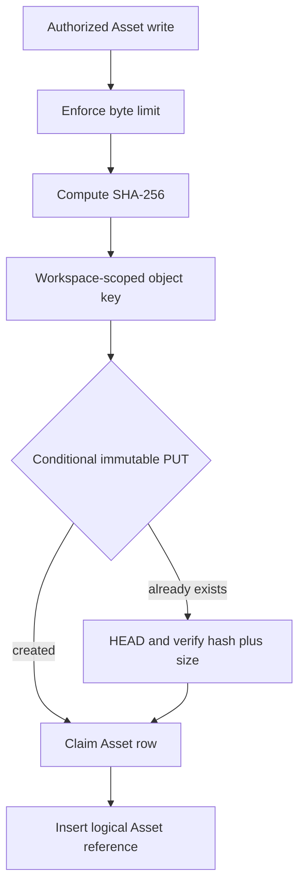
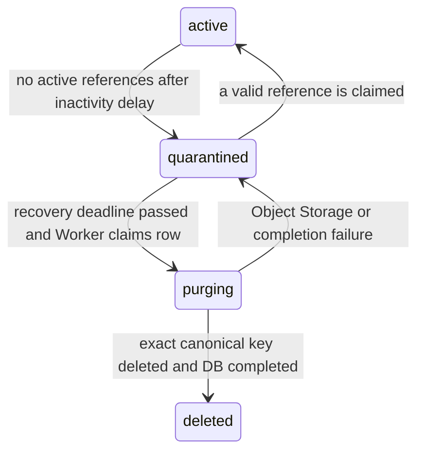

# Content-addressed Asset Storage

Status: implemented domain and persistence foundation

KOMYAKU stores image, PDF, diagram preview, and generic-file bytes outside Canonical Document JSON. The implemented storage boundary deduplicates exact bytes inside one Workspace while keeping authorization, logical references, and deletion decisions separate.

## Write flow



The key format is:

```text
workspaces/{workspace_uuid}/assets/sha256/{first_two_hash_chars}/{sha256}
```

The Workspace UUID is part of the key. Equal bytes in different Workspaces therefore do not share an object and cannot become a cross-tenant existence oracle. Hash equality never grants read access.

The S3-compatible write uses `If-None-Match: *`. A concurrent winner creates the immutable object; a loser accepts reuse only after `HEAD` returns the expected `content-sha256` metadata and byte size. PostgreSQL independently enforces one active content-addressed Asset for a Workspace and hash.

## Reference accounting

`asset_references` records the logical owner of an Asset:

- Workspace and Asset identity;
- referrer type and UUID, such as a Document Node or Version;
- relation, such as `source`, `preview`, or `attachment`;
- creating user and timestamps;
- `released_at` for an auditable soft release.

An active-reference unique index makes repeated claims idempotent. Releasing a reference does not delete the object or Asset row. Physical deletion is a later retention operation and must consider all active references, trash and recovery windows, published Versions, archive policy, and legal holds.

## Failure and reconciliation model

Object Storage and PostgreSQL cannot share one atomic transaction. KOMYAKU writes the deterministic immutable object first and then claims the database Asset and reference. A database failure may therefore leave an unreferenced object. It must be found by an authorized prefix reconciliation job and quarantined through retention; request handlers must not delete it as rollback.

Existing conversation-import objects remain in `immutable-keyed` mode. New CAS objects use `content-addressed` mode, allowing migration without rewriting or weakening the immutable raw-import archive.

## Quarantine and retention GC

The implemented lifecycle is:



Reconciliation lists a bounded page under one Workspace Asset prefix. A canonical object without a live database Asset is recorded in `asset_orphan_objects` with a recovery deadline. Discovery never deletes. Invalid or unexpected keys are counted but excluded from deletion.

PostgreSQL `FOR UPDATE SKIP LOCKED` claims purge candidates across Workers. Asset creation uses a Workspace-and-hash advisory transaction lock, and a claim cannot reactivate a row while it is `purging`. Before every Object Storage deletion the maintenance service revalidates the Workspace prefix and complete SHA-256 key. Failure returns the item to quarantine without retaining provider error text.

## Inspection and authenticated delivery

Every content-addressed Asset begins with `inspection_status = pending`. A bounded Worker claim uses an expiring PostgreSQL lease, performs a ranged Object Storage read, and records an accepted or rejected policy version. Expired leases can be reclaimed by another Worker. Provider failures return to `pending` with a retry delay and become `error` after the bounded attempt limit; provider error text is not persisted.

The initial signature policy accepts matching PNG, JPEG, GIF, WebP, and PDF signatures. Complete small text and JSON can also be accepted. SVG, ambiguous binary data, and incomplete large text are rejected until stronger isolated rendering or scanning exists. This policy is not an antivirus claim.

An authenticated download lookup joins the exact Workspace membership and requires a verified User, active lifecycle, and accepted inspection. The API returns no key or hash. It creates only a short-lived signed attachment URL whose storage response is forced to `application/octet-stream` and `private, no-store`. Inline preview and public/unlisted delivery use separate future policies.

## Current boundary

Implemented:

- key construction, hashing, conditional write, and conflict verification;
- Workspace-scoped PostgreSQL uniqueness;
- transactional Asset/reference claim;
- idempotent active references and soft release;
- authorization-before-storage and configurable upload-size enforcement;
- bounded orphan reconciliation and durable orphan records;
- reference-zero quarantine, recovery deadlines, retryable physical GC, and Operator audit summaries;
- PostgreSQL concurrency coordination for Asset claims and maintenance Workers;
- leased media inspection with conservative format verification;
- inspected-only authenticated signed attachment delivery;
- unit tests and an opt-in PostgreSQL concurrency integration test.

Not yet exposed as a public upload route. Editor insertion, production malware scanning, isolated inline previews, public/unlisted delivery, published/archive/legal holds, and quota metering remain separate work. Production purge scheduling stays disabled until those retention gates are connected.

## 日本語要約

同じWorkspace内で同一Byte列をSHA-256により再利用します。異なるWorkspaceではObjectを共有しません。参照解除は論理的に記録するだけで原本を即時削除せず、Retention、公開Version、法的保持を確認する後続処理に委ねます。

## 简体中文摘要

相同工作区内的相同字节通过 SHA-256 安全复用，不同工作区之间不共享对象。解除引用只记录逻辑状态，不会立即删除原始对象；物理清理由后续保留策略在检查发布版本、恢复期与法律保留后执行。
