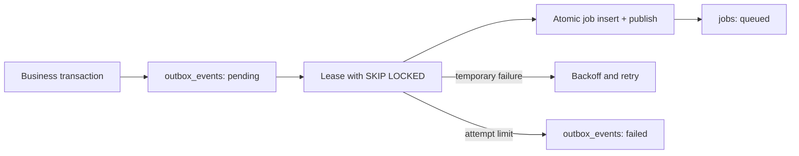

# Single Serverから分散Runtimeへの移行設計

- Initial deployment: Single server
- Target capability: Horizontal API and Worker scaling
- Updated: 2026-08-13

## 1. 方針

初期は運用の単純さを優先して、Bun/Hono APIとWorkerを1つのServerで実行する。ただし、単一Process固有の状態へ依存せず、負荷増加時にAPI ReplicaとWorker Replicaを追加できるようにする。

Microserviceを先に導入しない。まずModular MonolithとしてDomain境界とAdapter境界を守る。

## 2. Deployment段階

### Phase A — Single Server

```text
Bun / Hono
├ HTTP API
├ Outbox Poller
└ Background Worker
        │
        ├ PostgreSQL
        └ Object Storage
```

### Phase B — Process分離

```text
API Process
Worker Process
Scheduler Process
        │
        ├ PostgreSQL Outbox
        └ Object Storage
```

同じRepositoryとJob Handlerを使い、起動Roleだけを変更する。

### Phase C — Horizontal Scale

```text
Load Balancer
├ API Replica A
├ API Replica B
└ API Replica C

Queue
├ Worker Replica A
├ Worker Replica B
└ Worker Replica C

Shared services
├ PostgreSQL HA
├ Object Storage
├ Cache / Rate Limit Store
└ Observability Backend
```

### Phase D — Multi-region候補

Multi-regionはLatencyだけで決めず、Data Residency、Consistency、Backup、運用体制を含めて別ADRで判断する。Version DAGの書き込みを安易なActive-Activeにしない。

## 3. Stateless API

Replicaへ依存してはいけない状態：

- Session
- Permission
- Idempotency Record
- Upload状態
- Sync状態
- Rate Limit Counter
- Job Queue
- Subscription / Usage

これらは共有Storeへ置く。Process Memoryは再生成可能なCacheだけに使用する。Sticky Sessionを正しさの前提にしない。

## 4. Durable Work

初期はPostgreSQL Transactional Outboxを利用する。Business Transactionと同じTransactionで`outbox_events`を作り、Commit後にPollerがJobへ配送する。

```text
Business write
 ↓ same transaction
Outbox event
 ↓ commit
Outbox poller
 ↓ at-least-once
Idempotent handler
```

QueueやBrokerを導入しても、Domain Event SchemaとHandlerは維持する。

現在の実装では、`single`と`worker` ModeがPostgreSQL Outbox Dispatcherを実行し、`api` ModeはHTTP処理だけを担当する。複数Dispatcherは`FOR UPDATE SKIP LOCKED`と期限付きLeaseで競合を避ける。Outboxから`jobs`への書き込みとOutboxの`published`化は同じTransactionで行い、`outbox:<event_id>`のUnique Idempotency KeyでCrash後の重複作成を防ぐ。



Job Runnerも`single`と`worker` Modeで動作し、登録済みJob Typeだけを期限付きLeaseで取得する。各実行は`job_attempts`へ記録される。Worker停止でLeaseが失効した場合はAttemptを`lease_expired`として閉じ、残り試行があれば再取得し、上限なら`dead_letter`へ移す。未知のJob Typeは誤って成功扱いにせずQueueへ保持する。

## 5. Job分類

| Job | Partition Key | Retry | 注意点 |
|---|---|---|---|
| Snapshot verification | `version_id` | 可 | Hash一致を確認 |
| Diff generation | `document_id` | 可 | 派生Cacheのみ更新 |
| Search indexing | `document_id` | 可 | Originalを変更しない |
| Export rendering | `export_id` | 可 | Renderer Versionを保存 |
| Email | `notification_id` | 制限付き | Provider重複送信を防止 |
| Usage aggregation | `workspace_id` | 可 | Ledgerを冪等集計 |
| Backup verification | `backup_id` | 可 | Restore結果を監査記録 |

Job Payloadへ本文を直接埋め込まない。

## 6. Idempotency

外部からのMutation Requestは`Idempotency-Key`を受け付けられる構造にする。KeyはUser / Workspace / Operation ScopeとRequest Fingerprintへ関連付ける。

同じKeyで異なるRequestが来た場合はConflictとして拒否する。保存済みResponseを無期限保持せず、OperationごとのRetentionを定義する。

現在の実装はKey原文をScope付きHMAC、受信Bodyの完全なByte列をSHA-256として保存する。Response BodyやSession Tokenは保存せず、Statusと非秘密のResource ReferenceだけをReplayする。Middlewareは対象Mutationへ明示的にMountし、秘密Credentialを返す認証Routeには自動適用しない。

Job Handlerは、対象Resourceの完了状態または一意Constraintを確認して重複実行を無害化する。

## 7. Concurrency

- Branch Headは`expected_head_version_id`でOptimistic Concurrency Controlする。
- Usage ReservationはDatabase TransactionまたはAtomic shared operationで行う。
- SchedulerはDatabase LeaseまたはLeader Electionを使用する。
- Long-running Jobは期限付きLeaseとHeartbeatを持つ。
- Distributed LockをVersion Graphの正しさの唯一の根拠にしない。

## 8. Storage

- Immutable SnapshotとAssetは全Replicaから利用できるObject Storageへ置く。
- Local Filesystemは一時Fileだけに使用する。
- 一時File名にDocument titleを使わない。
- Uploadは将来Multipart / Signed URLへ移行可能にする。
- Object書き込みとDB Transactionの不一致はPending StateとOutboxで回復する。

## 9. Database Evolution

初期は単一PostgreSQL Primaryを使用する。

成長順序の候補：

1. Connection PoolとQuery最適化
2. Read Replica
3. Table Partitioning
4. HA / Automated Failover
5. WorkspaceまたはDocument境界のSharding検討

MigrationはExpand / Migrate / Contractを使用し、複数Application Versionが一時共存できるようにする。

## 10. HealthとShutdown

- LivenessはProcess応答だけを確認する。
- Readinessは新規Trafficを安全に処理できるかを確認する。
- Dependency障害でLivenessまで失敗させ、Restart Stormを起こさない。
- SIGTERM時はReadinessをFalseにしてからGraceful Shutdownする。
- Job Leaseは完了、失効、または明示返却する。

## 11. Observability

最低限のDimension：

```text
service
instance_id
deployment_mode
request_id
trace_id
job_type
queue_depth
job_lag
retry_count
database_latency
object_storage_latency
```

Document本文、秘密共有Token、認証TokenをLogやTraceへ含めない。

## 12. Scale Trigger

次の実測値を基にProcess分離またはReplica追加を判断する。

- API CPU / Memory飽和
- P95 / P99 Latency
- Queue Lag
- Export / DiffがInteractive Requestを圧迫
- Database Connection枯渇
- Object Storage Bandwidth
- Deploy時の停止許容時間

User数だけをScale Triggerにしない。
