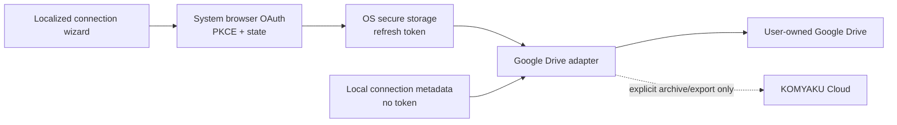
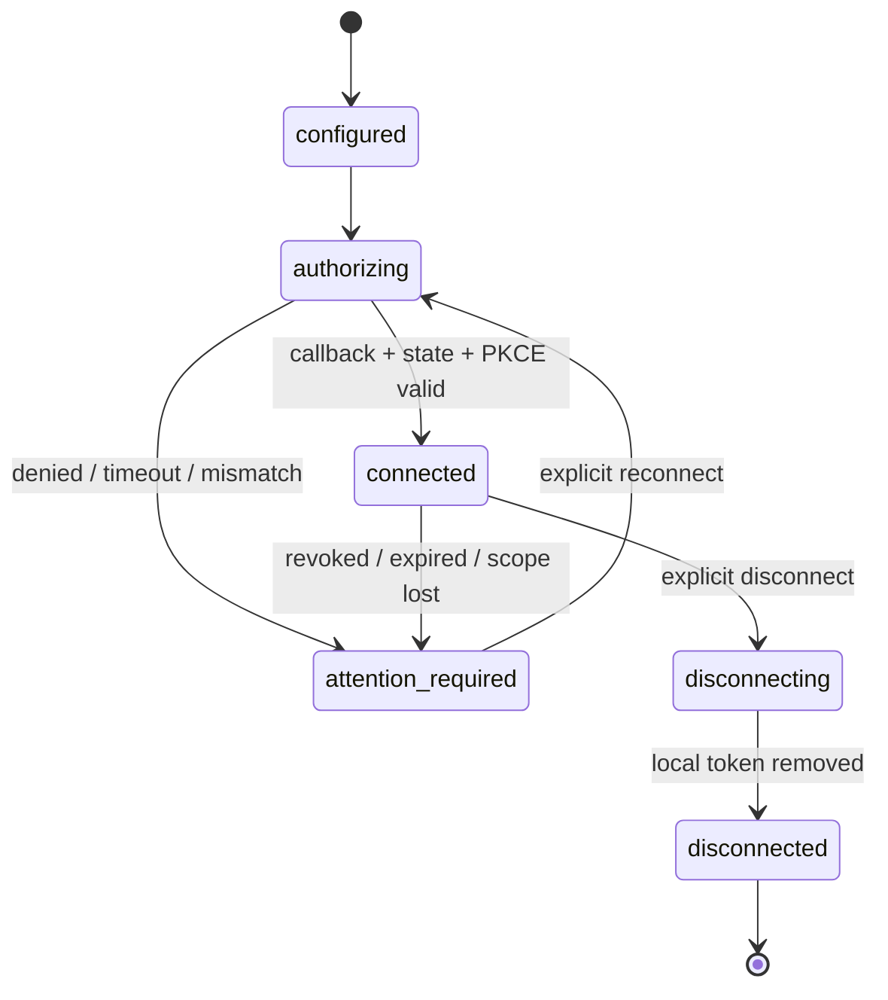

# External Provider Connections

Decision authority: `docs/adr/ADR-039-user-owned-external-provider-connections.md`

## 1. Purpose

External Provider Connectionは、KOMYAKUが外部StorageやAPIへの接続能力を提供しながら、接続先Account、OAuth Project、料金、QuotaをUser自身が所有できる境界である。最初の候補はGoogle Drive BYO OAuthであり、実装は未着手である。

## 2. Boundary



Cloudへの点線は、CloudがBYO Tokenを受け取る意味ではない。初期実装ではOAuthとDrive API CallをDesktop内で完結させ、TokenをKOMYAKU Serverへ送らない。

## 3. Connector interface

```text
ExternalProviderAdapter
├ validateConfiguration(publicConfiguration)
├ beginAuthorization(capabilitySet)
├ completeAuthorization(callback)
├ inspectGrantedScopes()
├ testConnection()
├ listAppFiles(pageToken)
├ putImmutableArchive(bytes, checksum, idempotencyKey)
├ getArchive(providerObjectId)
├ deleteOrTrashArchive(providerObjectId, explicitUserIntent)
└ disconnect(revoke)
```

Provider ErrorはStable Error Codeへ変換し、Google Response本文、File名、User email、TokenをLogへ出さない。Retryは429、5xx、Network failure等の明確な一時ErrorだけへBounded Backoffを適用する。

## 4. Connection state



`connected`はTokenの永続性を保証しない。各Operationで必要Scopeを確認し、`invalid_grant`やScope不足ではDocumentを変更せず`attention_required`へ移す。

## 5. Metadata and secrets

Local metadata candidate:

```text
external_provider_connections
id
owner_type
owner_id
provider
auth_mode
capability_set
client_id
requested_scopes_json
granted_scopes_json
secure_token_reference
status
provider_account_hint_encrypted_or_null
created_at
updated_at
last_verified_at
schema_version
```

`client_id`はOAuth SecretではないがUser構成情報としてPrivate扱いにする。Token referenceはOpaqueで、Token値を含めない。Crash dump、Analytics、Support bundle、Clipboard履歴へCredentialを含めない。

`.komyaku` Archiveへ含めてよいもの：

- Provider type
- Capability set
- Export先Objectの非秘密Reference（Userが選択した場合）
- Content checksum
- Export timestamp

含めてはいけないもの：

- Access/Refresh Token
- Authorization Code、PKCE Verifier、OAuth `state`
- Client Secret、Service Account key、API key
- OS Secure Storage reference

## 6. Google Drive profiles

### `drive_backup`

- Scope: `https://www.googleapis.com/auth/drive.file`
- Payload: `.komyaku` Archiveまたは明示Export
- File identity: Google File IDをLocal metadataへ保持
- Write: checksum検証後にRevision metadataを保存
- Delete:自動同期の副作用で削除せず、Userの明示操作またはRetention Policy確認を要求
- Sharing: Permissions APIを呼ばず、KOMYAKU VisibilityをDrive ACLへ自動変換しない

### Deferred profiles

- Google Pickerによる既存File選択
- App Data Folder
- Workspace共有Connection
- Shared Drive
- Drive全体のBackup/Restore
- Google Docs native conversion
- Drive Activity
- Drive Changes push notifications
- その他のGCP API

Deferred profileはScope、Data flow、Quota、Billing、Deletion、Organization Policy、Verification requirementを個別ADRで決定する。

## 7. Setup wizard

```text
1. Choose “My Google Cloud Project”
2. Open official Google Cloud setup guide
3. Create/select Project
4. Enable Google Drive API
5. Configure OAuth consent and allowed/test users
6. Create Desktop app OAuth Client
7. Paste Client ID
8. Validate Client ID shape locally
9. Show exact requested scope and responsibility boundary
10. Open system browser and authorize
11. Validate callback, state, PKCE, and granted scope
12. Store token in OS secure storage
13. Run a non-destructive connection test
```

WizardはGoogle Console UIの固定Screenshotや位置に依存せず、公式URL、期待するResource Type、検証結果を案内する。Google Console変更に追随できるようGuide VersionとLast Verified Dateを持つ。

## 8. Failure and portability

- Drive障害中もLocal Document、Version、Exportを利用可能にする。
- Upload中断時は同じContent HashとIdempotency metadataから安全に再開または再送できる設計にする。
- Remote File欠落をLocal削除へ自動伝播しない。
- Provider切替時は一度Open `.komyaku` ArchiveへExportし、別ProviderへImportできる。
- Provider Lock-inを避けるため、Google固有MetadataをCanonical Documentへ混入させない。

## 9. Entitlement and accounting

Candidate keys:

```text
external.connection.personal.byo
external.connection.workspace.byo
external.connection.managed
external.backup.scheduled
external.backup.monitoring
```

BYO Providerへ送ったByteは`storage.cloud_bytes`へ加算しない。LocalからDriveへ直接送信する場合、KOMYAKU ServerのUsage Ledgerへ文書名、Google File ID、Byte内容を送らない。将来Entitlement判定が必要でも、Provider接続前にLocalで解決できるSigned Catalogまたは認証済みFeature判定とし、TokenをEntitlement Serviceへ渡さない。

## 10. Implementation gates

実装開始前に次を完了する。

- Tauriで利用するOS Secure Storage Adapter選定とThreat Model
- Loopback listenerのPort binding、CSRF、Code interception、Timeout Test
- PKCE/state/token redaction unit and integration tests
- Google OAuth/Drive API TermsとScope分類の再確認
- 英語、日本語、简体中文Wizard文面
- Token revocation、Account switch、Quota、Offline、Clock skew、Proxy/Firewallのfailure tests
- Security review
