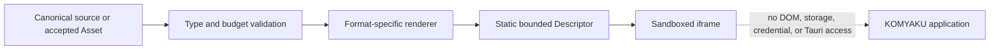

# Isolated Content Preview Architecture

## Trust boundary

The source remains authoritative. Render output is a cache that can be deleted and regenerated. A renderer cannot return arbitrary iframe permissions; the application accepts only the fixed static Descriptor contract.

## Implemented LaTeX path

`renderLatexPreview` accepts authored LaTeX, applies size and expansion budgets, and asks locally installed KaTeX for MathML. KaTeX trust remains disabled, so commands that could create HTML attributes or fetch external resources cannot produce active elements. The wrapper document contains no script and its CSP starts with `default-src 'none'`.

The Desktop component `SandboxedStaticPreview` requires `kind: "static-html"` and an empty sandbox token set. It does not accept `allow-scripts` or `allow-same-origin` from callers.

## Implemented authored SVG path

`sanitizeSvg` rejects DTD, entity, XML stylesheet, malformed XML, oversized input, excessive depth, excessive nodes, and excessive attributes. It does not mutate or serialize the supplied tree. Instead, it builds a new SVG-namespace document containing only static geometry, text, grouping, gradients, clips, masks, patterns, and markers from fixed allowlists.

Unknown elements are dropped with their complete subtree. This prevents a safe-looking child from escaping a `script`, `foreignObject`, or foreign-namespace wrapper. No event, `style`, `href`, `image`, `use`, animation, or external URL survives. Internal paint and clipping references must exactly match `url(#safe-id)`. The result still enters an iframe with no sandbox capabilities and a deny-by-default CSP.

These settings follow the current official guidance: KaTeX documents `trust`, `maxExpand`, and `maxSize` as the relevant untrusted-input controls, Mermaid identifies `strict` and `sandbox` as security levels, and MDN warns that `srcdoc` without a sandbox—or with `allow-same-origin`—can access the parent origin.

## Remaining format gates

| Format | Required before enabling | Current behavior |
| --- | --- | --- |
| Mermaid | pinned parser, secure config, directive/frontmatter/click/style rejection, budgets, SVG sanitization | capability-minimized hidden Tauri WebView implemented; packaged denial/recovery QA and editor integration remain gated |
| Authored SVG | XML/size budgets, active-content and external-reference removal, sanitized immutable output | implemented for the Basic SVG allowlist |
| Image | accepted inspection, decoded-pixel limits, short-lived authorized preview response, isolated frame | fail closed |
| PDF | accepted inspection, page/size limits, active-action removal, isolated local viewer or server rasterization | fail closed |

Reference documentation: [KaTeX security](https://katex.org/docs/security), [KaTeX options](https://katex.org/docs/options), [Mermaid security level](https://mermaid.js.org/config/schema-docs/config-properties-securitylevel.html), and [MDN `iframe.srcdoc` security considerations](https://developer.mozilla.org/en-US/docs/Web/API/HTMLIFrameElement/srcdoc).

## Mermaid execution boundary

`validateMermaidSource` serializes access to Mermaid's global configuration, applies the fixed secure configuration, and returns only the detected diagram type. `renderMermaidPreview` accepts output only from an injected `isolatedRenderer`; no default renderer is provided. Even a successful Adapter response is parsed and rebuilt by `sanitizeSvg` before a static Descriptor is returned.

The Desktop Adapter now executes in a hidden `mermaid-renderer` WebView. Tauri build-time command permissions are explicit and granted only to `main`; the renderer has no default core, SQL, credential, session, document, or conversation commands. It has only event listen/emit-to permissions for bounded envelopes. The Mermaid bundle is dynamically imported only in this entry mode. The returned SVG crosses the boundary as untrusted data and is rebuilt by the sanitizer before the main Window can display it.

This boundary is capability-minimized, not capability-free: it retains event IPC. Its eight-second timeout releases the main caller but cannot terminate a WebView that is consuming CPU or memory. Before editor integration, packaged QA must exercise successful rendering, malformed and adversarial inputs, timeout/recovery, and direct denial attempts against every sensitive command. A separately terminated renderer process remains a future hardening option if platform WebView isolation is insufficient.
