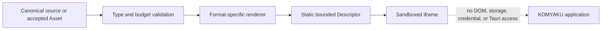

# Isolated Content Preview Architecture

## Trust boundary

The source remains authoritative. Render output is a cache that can be deleted and regenerated. A renderer cannot return arbitrary iframe permissions; the application accepts only the fixed static Descriptor contract.

## Implemented LaTeX path

`renderLatexPreview` accepts authored LaTeX, applies size and expansion budgets, and asks locally installed KaTeX for MathML. KaTeX trust remains disabled, so commands that could create HTML attributes or fetch external resources cannot produce active elements. The wrapper document contains no script and its CSP starts with `default-src 'none'`.

The Desktop component `SandboxedStaticPreview` requires `kind: "static-html"` and an empty sandbox token set. It does not accept `allow-scripts` or `allow-same-origin` from callers.

## Implemented authored SVG path

`sanitizeSvg` rejects DTD, entity, XML stylesheet, malformed XML, oversized input, excessive depth, excessive nodes, and excessive attributes. It does not mutate or serialize the supplied tree. Instead, it builds a new SVG-namespace document containing only static geometry, text, grouping, gradients, clips, masks, patterns, and markers from fixed allowlists.

Unknown elements are dropped with their complete subtree. This prevents a safe-looking child from escaping a `script`, `foreignObject`, or foreign-namespace wrapper. No event, `style`, `href`, `image`, `use`, animation, or external URL survives. Internal paint and clipping references must exactly match `url(#safe-id)`. The result still enters an iframe with no sandbox capabilities and a deny-by-default CSP.

These settings follow the current official guidance: KaTeX documents `trust`, `maxExpand`, and `maxSize` as the relevant untrusted-input controls, Mermaid identifies `strict` and `sandbox` as security levels, and MDN warns that `srcdoc` without a sandbox—or with `allow-same-origin`—can access the parent origin.

## Remaining format gates

| Format | Required before enabling | Current behavior |
| --- | --- | --- |
| Mermaid | pinned parser, secure config, directive/frontmatter/click/style rejection, budgets, SVG sanitization | hidden Tauri WebView, editor integration, packaged denial, restart, and timeout-recovery QA implemented; cross-platform pressure QA remains |
| Authored SVG | XML/size budgets, active-content and external-reference removal, sanitized immutable output | implemented for the Basic SVG allowlist |
| PNG preview representation | decoder-backed accepted inspection, encoded/decoded limits, authorized byte resolver, isolated frame | full-decode inspection, Cloud/Local Resolvers, static Descriptor, and Image NodeView implemented; insertion and packaged QA remain gated |
| JPEG/GIF/WebP | format-specific inspection, animation policy, encoded/decoded limits, authorized byte resolver, isolated frame | fail closed |
| PDF | accepted inspection, page/size limits, active-action removal, isolated local viewer or server rasterization | fail closed |

Reference documentation: [KaTeX security](https://katex.org/docs/security), [KaTeX options](https://katex.org/docs/options), [Mermaid security level](https://mermaid.js.org/config/schema-docs/config-properties-securitylevel.html), and [MDN `iframe.srcdoc` security considerations](https://developer.mozilla.org/en-US/docs/Web/API/HTMLIFrameElement/srcdoc).

## Accepted PNG preview Descriptor

`renderAcceptedPngPreview` does not accept an authored URL or an original Asset reference. It accepts only bytes supplied with an `accepted` inspection envelope whose detected MIME, exact byte size, width, and height agree with the PNG header. Encoded preview bytes are limited to 256 KiB and inspection-confirmed decoded dimensions to 16 million pixels. The resulting data URL exists only inside a fixed static document whose CSP permits `img-src data:` and nothing else; the iframe retains an empty sandbox token set.

The server now uses the `decoder-backed-png-v1` policy for complete PNG objects up to 1 MiB. It applies a 16 MP libvips input limit, performs a full raw decode, and persists width and height with the accepted result. The baseline signature policy still cannot satisfy the preview gate. The Cloud Resolver proxies only accepted PNGs up to 256 KiB, rechecks immutable SHA-256, and never exposes Object Storage URLs to the document DOM. The Local Resolver reads only constrained SQLite preview rows, rechecks their byte length and hash, and feeds the same static Descriptor boundary. Image NodeViews retain visible Canonical identity and alternative text when either Resolver fails. Local authoring uses a capability-scoped native command to fully decode and atomically commit a bounded PNG before the editor may create its Canonical Image Node; a failed editor insertion can leave only an unreferenced cache row, never an unverified document reference. The application now selects the Resolver from one centralized editor Workspace state: Local grants no Cloud authority, while Cloud binds one memory-only Session and Workspace and never falls back across authority domains. Selecting an Image Node exposes required alternative-text and structured caption editing for marked text, hard breaks, and stable-ID inline LaTeX. The update targets the stable Node ID, validates the complete Caption array, passes through a ProseMirror transaction and Yjs, and therefore enters the same validated Canonical checkpoint and restart-recovery path as document text. See ADR-053 through ADR-058, ADR-061, and ADR-063.

Local draft checkpoints also maintain document-to-Asset references in the same monotonic SQLite transaction. New previews begin as pending, become active when a Canonical checkpoint references them, and move to non-destructive quarantine after their final reference is removed or an insertion remains uncheckpointed beyond its grace period. Migration-era rows remain protected as legacy and no automatic path deletes the retained bytes. See ADR-060.

## Mermaid execution boundary

`validateMermaidSource` serializes access to Mermaid's global configuration, applies the fixed secure configuration, and returns only the detected diagram type. `renderMermaidPreview` accepts output only from an injected `isolatedRenderer`; no default renderer is provided. Even a successful Adapter response is parsed and rebuilt by `sanitizeSvg` before a static Descriptor is returned.

The Desktop Adapter now executes in a hidden `mermaid-renderer` WebView. Tauri build-time command permissions are explicit and granted only to `main`; the renderer has no default core, SQL, credential, session, document, or conversation commands. It has only event listen/emit-to permissions for bounded envelopes. At startup it attempts both a harmless main-only application-command canary and a read-only SQL plugin load; it refuses every render unless Tauri denies both invocations. The Mermaid bundle is dynamically imported only in this entry mode. The returned SVG crosses the boundary as untrusted data and is rebuilt by the sanitizer before the main Window can display it.

Main does not assume that the hidden WebView listener is ready at application startup. It installs the result and readiness listeners first, then sends a nonce-bound ping every 150 ms within a four-second readiness budget. The Renderer replies to that nonce only after the ACL canary is denied. Render requests are emitted only after this handshake; an unavailable or over-privileged Renderer fails closed.

This boundary is capability-minimized, not capability-free: it retains event IPC. Its eight-second timeout releases the caller and asks the privileged `main` Window to close and recreate the hidden renderer. A recreated renderer is not considered recovered until the readiness handshake and both denial canaries pass again. Only `main` receives the narrowly scoped WebView-create and Window-close permissions needed for this reset; the renderer capability remains event-only. This does not prove termination of a WebView consuming CPU or memory because WebView process sharing is platform-dependent. Packaged forced-timeout, pressure, and direct-denial QA remains required across supported platforms. A separately terminated renderer process remains a future hardening option if platform WebView isolation is insufficient.

## Editor integration

Diagram nodes use a ProseMirror NodeView owned by the Desktop layer. The NodeView always shows the authored Mermaid source and mounts a separate React preview root beside it. On Tauri Desktop, that root requests a static Descriptor from the hidden renderer and passes it to `SandboxedStaticPreview`; it never inserts raw renderer SVG into the editor DOM. On the Web build, no rendering request is attempted and a localized Desktop-only notice is shown. Rendering failure replaces only the disposable preview state and never removes or rewrites Canonical source.

The NodeView root is destroyed asynchronously to avoid a React Strict Mode cross-root unmount race discovered during browser QA. Mermaid remains in a dynamically imported renderer chunk rather than the editor's initial bundle.
