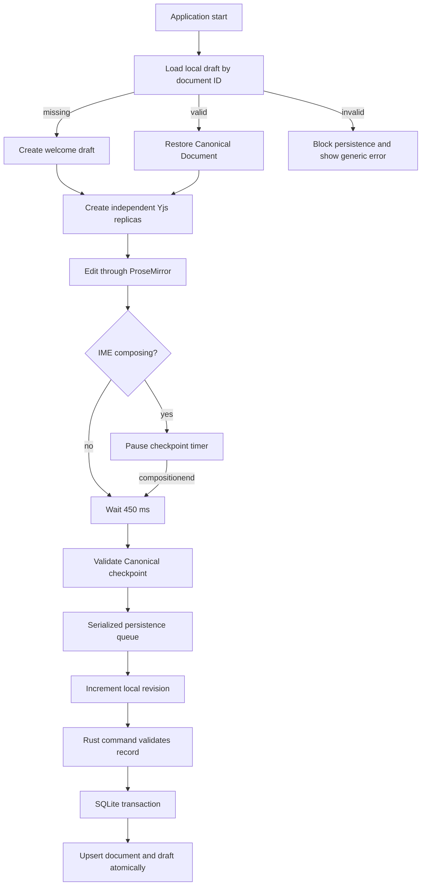

# Local Draft Recovery Architecture

- Updated: 2026-08-24
- Decision: `docs/adr/ADR-036-local-canonical-draft-recovery.md`
- Status: Canonical autosave and restart recovery implemented

## Runtime adapters

| Runtime | Storage | Intended use |
|---|---|---|
| Tauri desktop | SQLite `local_documents` and `local_drafts` | Authoritative local draft recovery |
| Vite browser | Origin-local `localStorage` | Feasibility and automated browser regression |

Both adapters accept the same record contract: Canonical document ID, schema version, validated JSON, monotonic local revision, and update time. The browser adapter is deliberately not presented as cloud sync or durable archival storage.

## Startup and save lifecycle



The persistence queue prevents overlapping checkpoint requests from racing revisions. An older local revision is rejected rather than overwriting newer content.

## Failure behavior

- Invalid JSON, unsupported schema, mismatched document identity, oversized content, or an invalid revision produces a stable internal error code.
- Authored content and provider error strings are not copied into the user-facing status.
- A failed restoration blocks automatic writes for the session so evidence is not destroyed before a recovery workflow exists.
- Tauri draft saves use one Rust-side transaction. A stale revision or storage error rolls back both document metadata and draft changes.
- The Rust command repeats bounded structural checks at the native trust boundary and maps internal database errors to stable codes.

## Commands

```text
bun test apps/desktop/test/local-draft-persistence.test.js
bun run test:e2e
bun run --filter @komyaku/desktop build
cd apps/desktop/src-tauri && cargo test
cd apps/desktop && bun run tauri build --debug --no-bundle
```

Playwright defaults to the locally installed Google Chrome channel. Set `KOMYAKU_PLAYWRIGHT_CHANNEL` to another installed Playwright channel when needed. CI must provision that browser explicitly.

## Remaining work

- packaged Tauri Simplified Chinese Pinyin IME pass on a provisioned test host; Japanese Kotoeri has passed;
- bounded Yjs update log and compaction for finer crash recovery;
- recovery snapshot rotation and a user-facing corrupt-draft recovery flow;
- immutable checkpoint-to-Version commit operation.

## Multilingual summary

- 日本語: Tauriでは文書情報と検証済みドラフトを単一のSQLite transactionで保存し、古いrevisionや失敗時は両方をrollbackする。
- English: Tauri saves document metadata and the validated draft in one SQLite transaction; stale revisions and failures roll back both records.
- 简体中文：Tauri通过同一个SQLite事务保存文档信息和已验证草稿；版本过旧或保存失败时会同时回滚两项记录。
