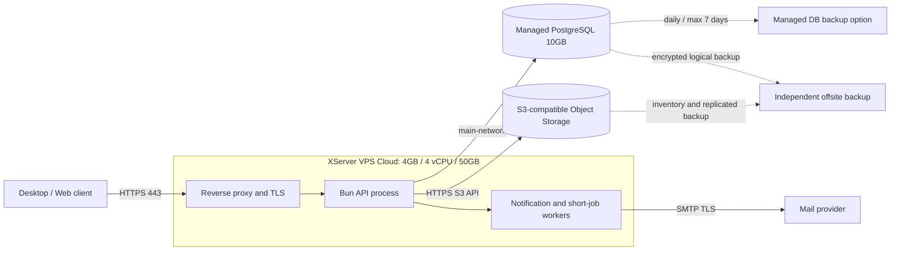
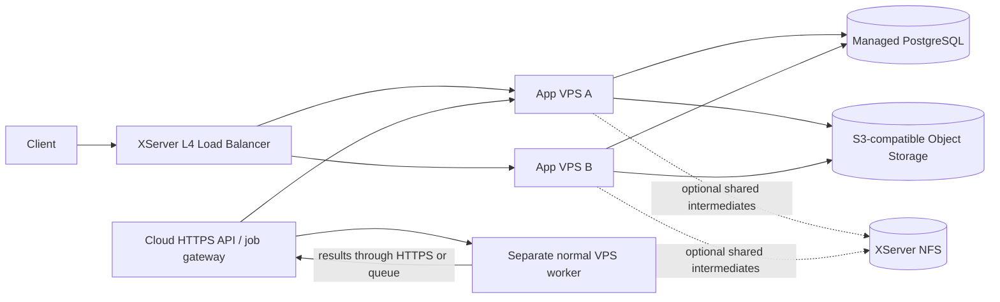

# XServer VPS Cloud small-start deployment

- Updated: 2026-09-01
- Price basis: official tax-inclusive prices retrieved on 2026-09-01
- Decision: `docs/adr/ADR-074-xserver-vps-cloud-small-start.md`

## Initial topology

Only ports 80 and 443 are publicly reachable. Port 80 redirects to HTTPS. SSH uses public-key authentication and an allowlist or administrative VPN; password login and root remote login are disabled after bootstrap. PostgreSQL is reachable only through XServer's default private `main-network`. Application logs are structured and must exclude authored text, email addresses, tokens, passwords, Archive bodies, and Object Storage credentials.

## Initial plan and monthly cost

| Component | Selected plan | Monthly price | Reason |
| --- | --- | ---: | --- |
| App VPS | 4GB RAM, 4 vCPU, NVMe 50GB, one-month contract | ¥2,480 | Enough for reverse proxy, Bun API, and small workers while measuring real demand |
| Managed PostgreSQL | 10GB, 2GB RAM, 1 vCPU | ¥1,441 | Text, metadata, identity, graph, and job state begin small; binary Assets do not enter DB |
| DB automatic backup | Daily, up to seven days | ¥220 | Minimum operational recovery layer; not the only backup |
| L4 Load Balancer | Not initially contracted | ¥0 | One backend provides no availability benefit from a load balancer |
| NFS | Not initially contracted | ¥0 | Current server requires S3 semantics; NFS has no user-restorable backup |
| Bandwidth expansion / extra IP | Not initially contracted | ¥0 | Standard network is sufficient until measurements show otherwise |
| **XServer fixed subtotal** |  | **¥4,141/month** | Tax included; variable external services excluded |

The official page also lists a 12-month App VPS price of ¥2,068/month equivalent. Do not lock into the long contract until the staging load/failure pass, backup restore drill, and first production observation window are complete. Promotional free-period extensions are excluded from forecasts.

External S3-compatible Object Storage, SMTP delivery, domain/DNS choices, error monitoring, uptime monitoring, and offsite backup are separate costs. Their vendors must be selected through a security, data-location, egress, retention, and deletion review before launch.

## Process layout on the first App VPS

- Reverse proxy: TLS 1.2+, HTTP/2, request-body limits, security headers, rate limiting, and upstream health checks.
- `DEPLOYMENT_MODE=single`: Bun API and PostgreSQL-backed outbox/job processing may run on one host, but as independently restartable services.
- `AI_TRAINING_DEFAULT=deny`: production startup must continue to fail closed if this is not explicit.
- Object Storage: retain the existing HTTPS S3 adapter and immutable/content-addressed keys. Do not expose raw bucket credentials to clients; issue short-lived authorized URLs.
- Database pool: begin below the Managed DB connection ceiling, with a conservative per-process pool and alerts before adding replicas.
- Deployment: immutable release artifact, migration as a one-shot pre-deploy job, health/readiness endpoints, graceful shutdown, and rollback to the prior artifact without rolling Schema backward destructively.

## Backup and recovery

Managed DB backup protects only the recent seven-day window. In addition:

1. Create an encrypted nightly logical PostgreSQL backup in an independent failure domain.
2. Retain daily, weekly, and monthly generations according to the documented retention policy.
3. Record Object Storage inventory and content hashes; replicate irreplaceable Objects to independent storage.
4. Keep deployment configuration and infrastructure instructions in version control, but keep Secrets in a Secret Manager or host-protected environment store.
5. Test restoration into an isolated environment before launch and at least quarterly thereafter. A backup is not accepted until Document Graph, Assets, authentication state, and `.komyaku` export can be read after restoration.

NFS may later hold reproducible intermediate artifacts or shared POSIX files. Because XServer states that NFS has no customer-restorable backup, it must never become the sole location of a Canonical Asset.

## Expansion topology

The separate Worker has no network or credential path to Managed PostgreSQL. When a second App VPS is added, use the Standard L4 Load Balancer shown by XServer at ¥3,300/month and deploy TLS termination consistently on each backend because the service is Layer 4. Do not use local memory for Session, Rate Limit, Idempotency, or Job ownership. Add NFS only for a measured shared-filesystem need; keep S3 as the Canonical Asset boundary.

## User actions needed before staging

Do not send credentials through chat. When ready, create the resources in the XServer control panel and store all generated Secrets locally in an approved Secret Manager.

1. Contract one 4GB/50GB VPS using a one-month term.
2. Add PostgreSQL 10GB and its daily seven-day backup option in the same Cloud environment.
3. Confirm the VPS and DB are attached to `main-network`; do not expose DB publicly.
4. Prepare a domain and DNS record for the staging API.
5. Select S3-compatible Object Storage and SMTP providers; record region and retention decisions.
6. Provide a disposable staging hostname and access path, but not passwords or private keys, so the production-topology validation can begin.

## English summary

Start with one 4GB XServer Cloud VPS plus the 10GB Managed PostgreSQL plan and its seven-day daily backup option. The XServer subtotal is ¥4,141/month on a monthly term. Keep the existing HTTPS S3 object-storage boundary; do not add NFS until there is a measured multi-server POSIX-sharing need. Add a second App VPS and the standard L4 load balancer only when availability or sustained load requires it. Heavy AI and batch workers run on a separate normal VPS and communicate through HTTPS or a queue, never direct Managed DB access.

## 简体中文摘要

初期使用一台4GB XServer Cloud VPS，并搭配10GB托管PostgreSQL及最长7天的每日备份。按月合约计算，XServer固定小计为每月4,141日元。继续使用现有HTTPS S3对象存储边界；只有在多服务器确实需要共享POSIX文件时才增加NFS。可用性或持续负载达到阈值后，再增加第二台应用VPS和标准L4负载均衡器。AI及批处理Worker部署在独立普通VPS上，通过HTTPS API或任务队列通信，不得直接连接托管数据库。
