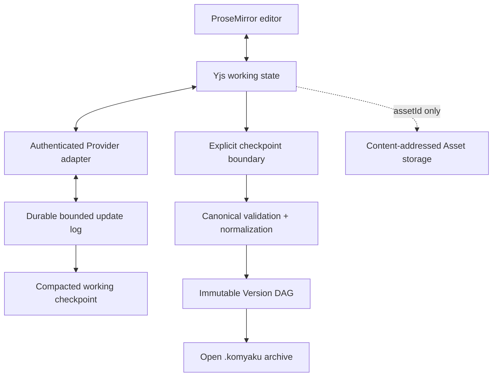

# Yjs Collaborative Working-state Architecture

- Status: Headless foundation and browser feasibility view implemented; native Tauri validation remains next
- Updated: 2026-08-22
- Decision: `docs/adr/ADR-035-yjs-collaborative-working-state.md`

## Purpose

This design adds real-time and offline convergence without allowing a collaboration library to become KOMYAKU's archive format or historical source of truth.



## Layer responsibilities

| Layer | Owns | Must not own |
|---|---|---|
| ProseMirror | Editing UX, IME transactions, selection | Durable format |
| Yjs | Convergent live working state | Published history, Asset bytes |
| Provider adapter | Authentication, room routing, differential sync | Document authorization policy in client code |
| Update persistence | Idempotent update storage, compaction, recovery | Unbounded replay log |
| Canonical checkpoint | Validation, normalization, stable Node IDs | Live cursor presence |
| Version engine | Immutable Versions, branches, parents, commit metadata | Keystroke-level CRDT operations |
| `.komyaku` archive | Open portable content and history | Required Yjs implementation details |

## Update and recovery contract

1. The client opens an authenticated Workspace/Document room.
2. The Provider exchanges state vectors and only missing updates when supported.
3. Incoming updates are bounded, authorized, rate-limited, and applied idempotently.
4. Durable persistence occurs according to the Provider acknowledgement contract.
5. A compactor periodically writes a current working checkpoint and safely retires covered log entries according to retention policy.
6. A user save, recovery policy, or approved autosave requests a Canonical checkpoint.
7. The checkpoint is converted, validated, normalized, deterministically encoded, and then committed to the Version DAG.

Single-server deployment may colocate the Provider and compactor with the application. Their interfaces must still allow room ownership and compaction work to move to multiple replicas later. Sticky sessions may optimize traffic but cannot be the only persistence or recovery mechanism.

## Stable identity and anchors

Canonical `nodeId` values remain stable through editor and Yjs projections. Live cursor/selection anchors use Relative Positions. Durable annotations such as comments use a composite anchor:

```text
nodeId
relativePosition (live optimization)
quotedText
contextBefore
contextAfter
anchorSchemaVersion
```

The contextual fallback permits repair after schema migrations, import normalization, or sessions where Yjs recovery data is unavailable.

## Origins and undo

Every mutation is classified at the adapter boundary:

```text
user:<memberId>
remote:<sessionId>
ai:<proposalId>
import:<jobId>
migration:<version>
system:normalization
```

Only local user origins enter the default local UndoManager scope. AI output is a proposal until the user accepts it; accepting it produces an attributable transaction and does not silently merge AI authorship into ordinary typing.

## Presence and privacy

Awareness transports only the minimum transient data required for collaboration, such as an opaque session identifier, display label/color chosen for the current room, and cursor/selection. It has a TTL, is removed on disconnect, and is excluded from Versions, archives, backups, full-text search, and product analytics. Email addresses, document excerpts, access tokens, and AI prompts are forbidden in Awareness payloads.

## Storage and security limits

Before production, define measured limits for:

- encoded update bytes and update rate per session;
- accumulated uncompacted bytes and update count per document;
- maximum live document complexity and checkpoint conversion time;
- room connection count and inactive-room eviction;
- recovery replay time and compaction failure retries.

Malformed or oversized input fails closed without committing a Canonical Version. Logs and traces contain identifiers and sizes, not document updates or decoded content.

## Delivery sequence

1. [Done] Stage 3 foundation: headless two-client `y-prosemirror` convergence, differential offline rejoin, deterministic Canonical round trips, bounded update application, and origin-aware local undo.
2. [Done] Stage 3 browser validation: two live editors, composition-safe checkpoint suspension, Relative Position cursor restoration, disconnect/reconnect lifecycle, accessibility labels, and responsive layouts.
3. [Next] Stage 3 native validation: Japanese/Chinese IME composition in Tauri, crash/restart recovery, and automated browser regression coverage.
4. [Later] Stage 4: durable local persistence, checkpoint-to-Version commits, and offline recovery.
5. [Later] Collaboration stage: authenticated Provider, Relative Position comments, ephemeral Awareness, quotas, and operational metrics.
6. [Later] Scale stage: multi-replica room routing, shared persistence, compaction workers, load/failure tests, and measured partitioning.

The implemented boundary is exported from `packages/editor-core/src/collaborative-working-state.js`, and the browser feasibility view lives in `apps/desktop/src/components/CollaborativeEditor.jsx`. It does not provide a network Provider, durable update store, or Presence transport yet.

## Multilingual summary

- 日本語: Yjsは編集途中の同期に使い、保存時にCanonical検証を通してVersion DAGへ確定する。公開アーカイブとAsset保存はYjsから独立させる。
- English: Yjs synchronizes the working draft; validated deterministic checkpoints become immutable Versions. Archives and Assets stay independent.
- 简体中文：Yjs负责同步编辑中的草稿；通过Canonical验证的确定性checkpoint才会进入不可变Version。归档与Asset存储保持独立。
