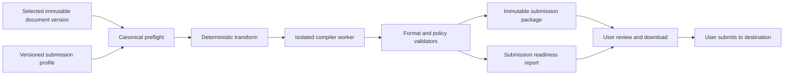

# Academic submission export

- Updated: 2026-09-01
- Status: Planned
- Decision: `docs/adr/ADR-076-academic-submission-export-profiles.md`

## Purpose

KOMYAKUで試行錯誤した論文を、選択したVersionだけから投稿用のSource BundleまたはReview PDF Packageへ変換する。投稿サイト自体をDocument Modelへ取り込まず、交換可能なProfile Adapterとして扱う。

## Pipeline



変換やCompileに失敗しても、選択したCanonical Versionを変更しない。修正提案はIssue一覧としてEditorへ戻し、利用者が新しいDocument Versionとして修正する。

## Initial export profiles

### `generic-latex-bundle@1`

```text
submission.zip
├ manuscript.tex
├ references.bib
├ figures/
├ supplementary/
├ README.txt
└ komyaku-submission-manifest.json
```

Main TeX、BibTeX、参照されたAssetだけを含む。Path traversal、Symlink、絶対Path、外部URL fetch、Shell escapeを禁止する。ManifestはDocument ID、Version ID、Branch ID、Profile ID／Version、生成時刻、Renderer／Compiler、各FileのMedia Type、Byte size、SHA-256を持つ。公開Packageへ不要な内部IDを出さないProfileも選択できる。

### `review-pdf-package@1`

```text
review-package.zip
├ manuscript.pdf
├ supplementary/
├ submission-readiness.json
└ submission-readiness.html
```

PDFは選択Versionから隔離Compileし、ReportにはPass、Warning、Error、Not checkedを分けて表示する。HTML ReportはScriptを含まないStatic documentとする。

## Later profiles

- 投稿先ごとのLaTeX Class／Template Profile
- Double-blind Review Package
- DOCX Manuscript Package
- JATS XML Article Package
- Machine-readable MathML Package
- Camera-ready Package
- Supplementary Dataset／Code Archive
- Institutional Repository Deposit Package

`arXiv`、学会、出版社等の固有名Profileは、実装時に各投稿先の公式仕様、利用規約、License、更新日を確認してから追加する。一般化した推測だけでCompatible表示を付けない。

## Metadata boundary

```text
AcademicSubmissionMetadata
├ title
├ abstract
├ keywords[]
├ authors[]
│  ├ displayName
│  ├ affiliationRefs[]
│  ├ optional ORCID
│  └ correspondingAuthor
├ affiliations[]
├ bibliographyStyle
├ fundingStatements[]
├ conflictOfInterest
├ dataAvailability
├ acknowledgements
└ targetProfileOverrides
```

MetadataはDocument本文と区別し、公開範囲とBranchを持つ。Double-blind ExportではAuthor関連項目を出力から除外するが、Canonical Metadataを削除しない。個人情報を含むため、通常Log、Analytics、AI Trainingへ送らない。

## Math and handwriting relationship

- Compact Math Paletteで入力したLaTeXはそのままSource変換対象になる。
- 手書き認識のRaw StrokeやRasterは、Supplementaryとして明示選択されない限り投稿Packageへ入れない。
- Recognition provenanceは内部履歴へ保持できるが、投稿Profileが要求しない限り提出物へ含めない。
- 数式番号、Label、Referenceは安定Node IDから投稿用Identifierへ決定的に割り当てる。
- Semantic Math Diffは投稿Package間の確認に利用できるが、初期版はLaTeX source Diffを正本とする。

## Reproducibility and security

- Compiler image／toolchain digestを固定する。
- Network disabled、read-only input、empty writable workspace、Shell escape disabledでCompileする。
- CPU、Memory、wall time、output、file count、path depthを制限する。
- Generated PDF、XML、DOCX、ZIPをFormat別に再検査する。
- Submission PackageはVerified Export evidenceと関連付け、Download後もManifestで検証可能にする。
- Workerは通常VPSへ分離でき、HTTPS APIまたはJob QueueだけでCloudと通信する。Managed PostgreSQLへ直接接続しない。
- Profile Template自体を署名またはdigest固定し、外部サイトから実行時にTemplateを取得しない。

## User experience

1. `提出用データを作成`を選ぶ。
2. Document Version、Branch、投稿Profileを選ぶ。
3. Metadata、Figure、Supplementary、匿名化設定を確認する。
4. Preflight Errorを修正する。Warningは理由を確認する。
5. Packageを生成し、Readiness ReportとPDF／Source差分を確認する。
6. PackageをDownloadする。
7. 利用者自身が投稿サイトへUploadし、最終提出する。

UIは日本語、英語、简体中文に対応する。Errorは「何が不足しているか」「どのNodeか」「自動検査できなかった項目」を明示し、色だけでSeverityを表さない。

## English summary

Academic submission output is a versioned profile-based export, not a mutation of the canonical document. The first targets are a deterministic LaTeX source bundle and a review PDF package with a readiness report. Only one explicitly selected version and branch is exported. Site-specific profiles are added only after checking the destination's current official requirements. Upload and final submission remain user-controlled.

## 简体中文摘要

论文投稿输出采用带版本的Profile转换，不修改Canonical文档。首批目标是可重现的LaTeX源码包，以及附带投稿检查报告的审稿PDF包。每次只导出用户明确选择的一个版本和分支。只有核对投稿网站最新官方规范后，才增加网站专用Profile。上传与最终提交仍由用户亲自完成。

