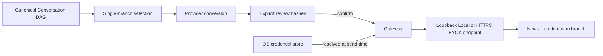

# AI Handoff Threat Model

## Flow

## Protected assets

- Provider API Key
- Conversation Message本文とAsset
- Userが選択しなかったBranch
- Handoff consent record
- Provider response

## Threats and controls

| Threat | Control | Residual risk |
|---|---|---|
| Imported promptが別BranchやSecret送信を指示 | SelectionはUI／Domain入力だけから作り、Message本文を命令として解釈しない | User自身が広い範囲を選ぶ可能性 |
| Branch混合 | 連続EdgeとSource終端を検証 | DAGの意味的関連性までは判定しない |
| Review後のContext差替え | Canonical HashとProvider Request Hashを送信直前に再計算 | Adapterの非決定的変換は利用不可 |
| Credential漏洩 | ConnectionにはReferenceだけを保持し、送信直前に解決 | 実行中Process Memoryには短時間存在 |
| Local modeによるLAN SSRF | Loopback hostnameだけを許可 | Loopback上の悪意あるService |
| BYOK盗聴 | HTTPS必須、URL Credential禁止 | Userが信頼しないHTTPS Endpointを選ぶ可能性 |
| Provider Error本文の漏洩 | Stable Error Codeのみ返す | OS／Network diagnosticは別境界 |
| 巨大Response | Content-Lengthと実Byte数を制限 | Streaming用の別制限が必要 |
| Unsupported Assetの黙示欠落 | WarningをHashへ含めて再確認 | 初期AdapterはText中心 |
| 元会話の上書き | 新Messageと`ai_continuation` Edgeだけを追加 | 永続化TransactionはDesktop／Server統合時に必要 |

## Required invariants

1. Selected Message IDは一つの連続Branchを構成する。
2. Source Messageは選択範囲の最後である。
3. CredentialをPreview、Confirmed Handoff、Log、Resultへ保存しない。
4. Confirmed Hashが現在のCanonical ContextとOutbound Requestの両方に一致するまで送信しない。
5. Local Endpointをloopback外へ拡張しない。
6. Provider responseは必ず新Branchとして追加する。
