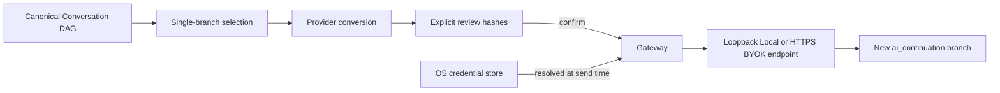

# AI Handoff Threat Model

## Flow

## Protected assets

- Provider API Key
- Conversation Message本文とAsset
- Userが選択しなかったBranch
- Handoff consent record
- Provider response

## Threats and controls

| Threat | Control | Residual risk |
|---|---|---|
| Imported promptが別BranchやSecret送信を指示 | SelectionはUI／Domain入力だけから作り、Message本文を命令として解釈しない | User自身が広い範囲を選ぶ可能性 |
| Branch混合 | 連続EdgeとSource終端を検証 | DAGの意味的関連性までは判定しない |
| Review後のContext差替え | Canonical HashとProvider Request Hashを送信直前に再計算 | Adapterの非決定的変換は利用不可 |
| Credential漏洩 | ConnectionにはReferenceだけを保持し、送信直前に解決 | 実行中Process Memoryには短時間存在 |
| Browser StorageへのCredential残留 | BYOK保存はTauri固定CommandとOS Credential Storeだけを使い、Web Storage fallbackを持たない | Browser開発PreviewではBYOK保存自体が利用不可 |
| 不正Referenceによる別Credential参照 | UUID形式をNative側でも検証し、`ai-provider-<uuid>` account namespaceへ限定 | 同一User権限でのOS Credential Store侵害は範囲外 |
| Local modeによるLAN SSRF | Loopback hostnameだけを許可 | Loopback上の悪意あるService |
| BYOK盗聴 | HTTPS必須、URL Credential禁止 | Userが信頼しないHTTPS Endpointを選ぶ可能性 |
| Provider Error本文の漏洩 | Stable Error Codeのみ返す | OS／Network diagnosticは別境界 |
| 巨大・不正なModel一覧 | `/models`応答を1 MiB、1,000件、ID 300文字へ制限し、BodyをErrorへ含めない | Provider固有Paginationは未対応 |
| 巨大Response | Content-Lengthと実Byte数を制限 | Provider圧縮後Sizeと展開後Sizeの差に注意が必要 |
| 巨大・無限SSE Stream | Raw受信Byteと累積Textの両方を上限検証し、AbortSignalでReaderを終了 | Provider側の課金停止時刻はProvider実装に依存 |
| Partial Responseの完全版誤認 | Streaming中はTransient表示だけにし、正常完了後だけBranchを追加 | Crash時の途中Textは復旧しない |
| Malformed SSE／Delta | `text/event-stream`、`data:`、JSON、String ContentをFail-closed検証 | Tool Call等の非Text Deltaは未対応 |
| Unsupported Assetの黙示欠落 | WarningをHashへ含めて再確認 | 初期AdapterはText中心 |
| Secret候補をWarningへ再掲 | DetectorはKindとCountだけを返し、Matched ValueをResult／Logへ含めない | Process Memoryには原文と一時Mask Copyが存在 |
| MaskによるArchive改変 | MaskはOutbound Copyだけへ適用し、元ConversationへResponse Branchだけを追加 | Pattern検出には誤検出・未検出がある |
| 元会話の上書き | 新Messageと`ai_continuation` Edgeだけを追加 | Userが明示的に別Branchを選ぶUIは今後追加 |
| Messageだけが残る部分保存 | 完了Handoff、Message、Edge、Canonical Graphを単一SQLite TransactionでCommit | OS強制終了後の実機Recovery QAは継続 |
| Handoff再試行による二重Branch | 同一Handoff ID・同一結果はidempotent、内容が異なるReplayはConflictとしてTransaction全体をRollback | 新しいHandoff IDでの意図的再送は別Branchになる |
| Browser Storageへの会話本文残留 | Browser PreviewはMemory-onlyでLocal／Session Storage fallbackを持たない | Tab終了で未保存Branchは失われる |
| 保存失敗後のAI二重送信 | 完成済みResponseをMemoryに保持し、RetryはSQLite保存だけを行う | App終了前にRetryしなければMemory上のResponseは失われる |
| Cloud Clientによる別ConversationへのResponse注入 | Transaction内でConversation、Workspace、Actor、Provider Connection所有権、選択Messageと連続Edgeを再検証 | 公開Routeは未接続 |
| Cloud部分保存 | Message、Edge、Handoff、Conversation更新、Outboxを一つのPostgreSQL TransactionでCommit | 実PostgreSQL統合試験は公開前Gate |
| Outbox経由の本文複製 | Completion EventはWorkspace、Conversation、Handoff、Result Message IDだけを保持 | Consumer側の取得権限を別途維持する必要 |

## Required invariants

1. Selected Message IDは一つの連続Branchを構成する。
2. Source Messageは選択範囲の最後である。
3. CredentialをPreview、Confirmed Handoff、Log、Resultへ保存しない。
4. Confirmed Hashが現在のCanonical ContextとOutbound Requestの両方に一致するまで送信しない。
5. Local Endpointをloopback外へ拡張しない。
6. Provider responseは必ず新Branchとして追加する。
7. Review UIは送信するMessage本文、Endpoint、Model、Warning、二つのHashを表示し、送信Buttonとは別のConsentを要求する。
8. Model discoveryもValidated Connectionと送信時Credential解決を通り、取得後のModel変更は以前のReviewを無効化する。
9. Masking状態を変更した場合はPayload ReviewとConsentを無効化し、二つのHashを再生成する。
10. Streamingの中止・失敗・Size超過ではMessageとEdgeを追加しない。
11. 正常完了したResponseは、Handoff、Message、Edge、Canonical GraphのすべてがCommitされるか、いずれもCommitされない。
12. 保存RetryはProviderへ再送信しない。
13. Cloud保存は選択BranchとProvider Connection所有権をTransaction内で再検証する。
14. Cloud Completion OutboxへMessage本文、Payload本文、Credentialを含めない。
