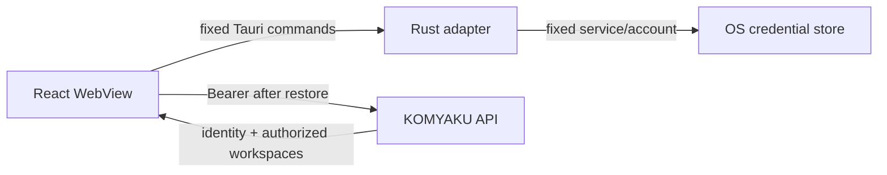

# OS Secure Session Threat Model

## Protected asset

対象はKOMYAKU CloudのBearer Session Tokenである。Password、Provider Export、Document本文、Workspace metadataはこのStoreへ入れない。

## Trust boundaries

WebViewはTokenをAPI送信時にMemoryへ持つため、実行中の任意Script実行を防ぐCSPとDependency integrityが必要である。OS Storeはat-rest防御であり、侵害済みUser AccountやOS Administratorからの保護を保証しない。

## Threats and controls

| Threat | Control | Residual risk |
|---|---|---|
| Local Storage、SQLite、Draftへの漏洩 | これらをSession保存に使用せずNative Commandだけを使用 | WebView Memoryには接続中Tokenが存在する |
| 任意Credentialの読み書き | ServiceとAccountをRust側定数へ固定 | 侵害された署名済みBinary自体は防げない |
| 異常に大きい／不正なSecret | 43文字Base64URL形状を保存時・読出時に検証 | 形式だけではServer validityを証明しない |
| 失効Tokenの再利用 | 起動時Server検証、401時削除 | Offline中は接続済みとして扱えない |
| 一時Network障害によるCredential喪失 | 401以外では削除しない | Userは復旧までLoginし直す可能性がある |
| Logout API障害 | Local MemoryとOS Storeを独立して削除 | OS StoreがLockedの場合の削除再試行UIは未実装 |
| Error経由の漏洩 | Native／API詳細をStable Codeへ縮約 | Crash dumpとOS診断設定はPlatform依存 |
| Supply-chain侵害 | Lockfile、限定Dependency、CI audit予定 | Dependency compromiseは完全には排除できない |

## Required invariants

1. PasswordをOS Session Entryへ保存しない。
2. Session TokenをLocal Storage、Session Storage、SQLite、Draft、Log、Telemetryへ書かない。
3. 保存TokenをServer検証する前にAuthenticated UIへ昇格しない。
4. 401以外の曖昧な障害をRevocationとして扱わない。
5. Logout時はServer結果にかかわらずLocal deletionを試みる。
6. WebViewからCredential namespaceを指定可能にしない。

## Validation

- Rust unit test：Token shape validation。
- JavaScript unit test：Browser fallbackがStorage emulationを行わないこと、Command名が固定であること、Native detailを露出しないこと。
- E2E：Login／Import／LogoutとWeb Storage非保存。
- Release前Native QA：macOS Keychain、Windows Credential Manager、Linux Secret ServiceでSave／Restart／Restore／Revoke／Logoutを確認する。
